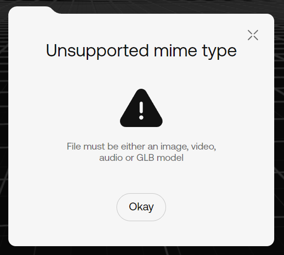

# Animations

## Supported 3D File Formats in oncyber

Although many different 3D file formats exist, there are two specific types supported by oncyber:

> .GLB (for most general purpose 3D models)

> .VRM (for Avatar Component models operated by users or scripted NPCs)

There is one exception to this, which is conditionally related to a specific aspect of animation:

> .FBX (for _animations_ performed by Avatar Component/VRM models)

If you try to add an .FBX file directly to oncyber through the Uploader, you'll receive an error like this:



This is because oncyber only uses and supports the _animation_ rigging portion of data in an .FBX file -- and only in the specific context of the Avatar Component for .VRM files. 

## Prepping Avatar Animations with .FBX Files and Mixamo

If you want an Avatar Component (whether user or NPC) to have custom animations in oncyber, you'll first need a rigged and animated humanoid model saved in the .FBX format.

To simplify the rigging and animation process (an otherwise complex pipeline that needs to follow a specific structure to work in oncyber), you can [use the Mixamo website](https://www.mixamo.com/).

Mixamo is a free-use repository of 3D models and (more importantly) animations that export in the .FBX format. To prep a custom animation for your Avatar Component in oncyber, simply:

1) Go to Mixamo and click the Animations tab once logged in
2) Browse for a simple animation you want to use (ie. a stylized walk cycle)
3) Optionally, adjust the sliders to modify the animation
4) Click the Download button (the default export settings are fine)

> Tip: the model used in an animated .FBX file doesn't matter since oncyber only applies the rigged animation data to the Avatar Component. This means you don't need to bother uploading your own model to Mixamo (unless you want to preview animations on it first).

## Adding New Avatar Animations in the Studio

As mentioned above, .FBX animations cannot be added through the Uploader like other assets. Instead, you'll need to add an Official Component to your scene with a special upload interface made for this purpose.

To add the "Avatar animations" Component, open one of your worlds in the oncyber Studio editor, hover over the left-hand column, and click the "Add assets" button.

By default, this will open on the "Official" and "Elements" tabs, where you can browse or search for the "Avatar animations" Component -- click this to add it to your World Items list (where it will now be called "vrm-anims"):


In the UI window that opens, you'll notice two tabs: Official and Uploaded. The Official tab has expandable Folders that allow you to replace the main default animations in oncyber.

To replace one of these defaults (the walk cycle, for example), simply open the Folder for the animation you want to replace, click the large "+" icon, and upload the desired .FBX animation you've prepped on your computer.

To test if it worked correctly, click out of the Avatar animations settings and hit the Preview button; all Avatar Component models (whether user or NPC) should now use the new uploaded animation when walking.

## Adding Custom Avatar Animations to the Uploaded Tab

To add other custom animations outside of the Official tab, you'll want to find an .FBX animation with an action other than the defaults like walking/running/jumping and add it in the Uploaded tab -- an attack, for example.

Once your first Uploaded animation has been added, the Component's UI should look like this:


> Note: each time you add an animation to the Custom tab, a new "Add Upload" Folder will be added, allowing for as many custom animations as you need.

In the context of this guide, you can ignore most of the settings for an uploaded .FBX animation. The most important point to note for now is the name: by default, these will be sequentially named "custom-#" after an upload.

Since the `Name` field is how you'll be accessing these animations in your code, and the animations themslves don't have a visually identifiable counterpart, you'll want to change this from "custom-#" to something more descriptive (ie. "lightattack").

## Docs Companion: Remixable Avatar Animations Sample

For an example of modified Default and Custom avatar animations that you can view and remix (to see the code and settings from the Studio side yourself), go here: https://v2.oncyber.io/avataranimationsample

## Using Custom Avatar Animations with Scripting

For expanded flexibility, you can use custom animations in combination with scripting -- however, first you'll need to disable the automatic animation system that transitions between default/Official animation states (idle, walking, running, etc).

Since the default controls handle playing the correct animation at the correct time, a side effect is that any custom animations triggered will be overwritten by these primary states.

If you want full control over Avatar Component animation logic, you can disable this system a few different ways. The most simple is a toggle found in the PlayerControls Component:


You can also turn this off directly in the code:

```ts filename="main" copy {6, 7}
import PlayerControls from "./PlayerControls"

export default class Game {

    onReady = () => {
        const playerControls = PlayerControls.getMain();
        playerControls.controls.autoAnimate = false;
    }
}
```

If you preview the experience you're working on now, you'll note that no animations at all trigger on the user's avatar.

Now that AutoAnimate is turned off, you'll need to manually code `Player.avatar.animation` to trigger under specific conditions and input states.

As a basic example, the following code will play the animation set in the Official tab for the `Run` state in all input states (idle, walking, jumping, etc):

```ts filename="main" copy {1,9}
import { Player } from "@oo/scripting"
import PlayerControls from "./PlayerControls"

export default class Game {

    onReady = () => {
        const playerControls = PlayerControls.getMain();
        playerControls.controls.autoAnimate = false;
        Player.avatar.animation = "Run";
    }
}
```

This can also be done for custom animations by replacing `Run` with what you've entered in the `Name` field.

In a similar manner, you can play animations on NPC Avatar Components:

```ts filename="main" copy {1,6,7}
import { Components, AvatarComponent } from "@oo/scripting"

export default class Game {

    onReady = () => {
        const avatar = Components.byId('avatar-script-id') as AvatarComponent;
        avatar.animation = "Run";
    }
}
```

## General Model Animations

oncyber also supports .GLB animations for non-avatar 3D models. If the 3D model you've uploaded contains an animation, you will have an option to make your object animatable and select which animation it should play:


Once you've enabled animations, you can play them from a script:

> You can an only play animations from sripts if you have the "Enable Animations" option turned on.

```ts filename="main" copy {1,6,7}
import { Components, ModelComponent, seconds } from "@oo/scripting"

export default class Game {

    onReady = async () => {
        const model = Components.byId('samplemodel') as ModelComponent;
        model.play("GM");
        await seconds(10);
        model.stop("GM");
    }
}
```

> Tip: NLA tracks with the same name in Blender will be combined into a single animation. If you want different animations accessible separately on a single model in oncyber, make sure to push those to NLA tracks and give them different names.

## Anime.js Animations

For cases where you need to animate objects from code -- particularly if you want a model's collisions to affect its visual location -- you can use the [Anime.js](https://animejs.com/) library.

Anime.js allows you to animate JavaScript objects from one state to another for a given duration.

Here is a simple JavaScript object as an example:

```ts copy
const obj = {
    key1: 0,
    key2: 5,
}
```

Next, let's animate that object into this:

```ts copy
{
    key1: 10,
    key2: 20,
}
```

We can achieve this by using the following code:

```ts copy
import anime from "animejs"

const obj = {
    key1: 0,
    key2: 5,
}

anime({
    targets: obj,
    key1: 10,
    key2: 20,
    duration: 1000, // this will animate for 1 second
})
```

In oncyber, we can use this logic to animate 3D objects in various ways:

```ts copy
import anime from "animejs";

const model = Components.byId("model-id");

anime({
    targets: model.position,
    x: -10,
    y: 0,
    z: 0,
    duration: 1000,
})

anime({
    targets: model.position,
    x: 10,
    y: 0,
    z: 0,
    duration: 1000,
})
```

As another example:

```ts copy
import anime from "animejs";

const model = Components.byId("model-id");

anime({
    targets: model.position,
    x: -10,
    y: 0,
    z: 0,
    duration: 1000,
    delay: 100,
    direction: 'alternate',
    easing: 'easeInOutQuad',
    loop: true,
    update: () => {
        console.log(model.position);
    }
})

```


AnimeJS comes with many different options. You can find more information about these in the [Anime.js documentation](https://animejs.com/documentation/).