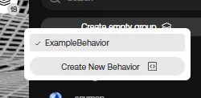
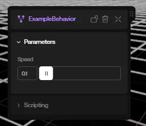
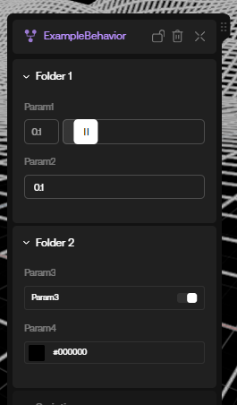

# Behaviors

Behaviors are reusable pieces of code that can be attached directly to Components through the oncyber Studio UI.

## Minimal Behavior

To create a new Behavior, open a new script tab and insert the following code:

```ts copy
import { ScriptBehavior } from '@oo/scripting'

export default class ExampleBehavior extends ScriptBehavior {

}
```

Save your script, then hover over one of your added Components in the right-hand column of the oncyber Studio UI, and you'll see a "+" icon appear.

Clicking that will open a list of any Behaviors added to that scene. Selecting one will attach it to the selected Component.



Once a Behavior is attached to a Component, the Component will turn into a group with the Behavior name parented/nested below in purple, signifying that it has been applied.

> Note: you cannot delete a script that contains a Behavior or a Component if you have an instance of it currently in your scene.

## Adding Actions to a Behavior

Currently, this Behavior is just an empty UI shell -- next, we need to add code for functionality.

Let's try a simple rotation as a demonstration:

```ts {5, 7-9} copy
import { ScriptBehavior } from '@oo/scripting'

export default class ExampleBehavior extends ScriptBehavior {

    private speed = 0.5;

    onUpdate(deltaTime: number) {
        this.host.rotation.y += this.speed * deltaTime;
    }
}
```

Note of the usage of `this.host` in the code above; since Behaviors are attached directly to a Component, you can access the objects they're attached to easily using this syntax.

In the same manner as Custom Components, Behaviors can also access different [lifecycle methods](./lifecycle), such as `onUpdate`.

Now, try previewing your game -- the Component you've attached the Behavior to should rotate.

## Adding Frontend Customization Through Parameters

Parameters allow you to add additional frontend modularity to a Behavior by creating UX fields that a user can tweak in the Studio.

In this example, let's allow to the user to adjust the speed of rotation through the frontend:

```ts {1, 5} copy /, Param/
import { ScriptBehavior, Param } from '@oo/scripting'

export default class ExampleBehavior extends ScriptBehavior {

    @Param({ type: "number", step: 0.1 })
    private speed = 0.5;

    onUpdate = (deltaTime: number) => {
        this.host.rotation.y += this.speed * deltaTime;
    }
}
```

Save the Behavior, and select it in the right-hand column -- you should now be able to adjust the rotation speed parameter with a slider through the frontend:



Find a list of [available Params here](./reference/scriptparam.md).

## Adding Folders to the Behavior UI

If you want to organize your Behavior's frontend UI for better UX, you can partition settings by using the @Folder decorator:

```ts {1, 5, 11} copy
import { ScriptBehavior, Param, Folder } from '@oo/scripting'

export default class ExampleBehavior extends ScriptBehavior {

    @Folder("Folder 1")
    @Param({ type: "number", step: 0.1, min: 0, max: 1 })
    private param1 = 0.1;
    @Param({ type: "text" })
    private param2 = "";

    @Folder("Folder 2")
    @Param({ type: "boolean" })
    private param3 = false;
    @Param({ type: "color" })
    private param4 = "#ffffff";
}
```

Though largely cosmetic, Folders are a great way to keep your Behavior UI clean and clear.



## Config

Behaviors have access to additional config options for further customization:

```ts {5-9} copy
import { ScriptBehavior } from '@oo/scripting'

export default class ExampleBehavior extends ScriptBehavior {

    static config = {
        title: "Display Name",
        description: "description of the behavior",
        tip: "tip on how to use the behavior",
    }
}
```

## Docs Companion: Remixable Sample Behavior

For a simple example that you can view and remix (to see the code and settings from the Studio side yourself), go here: https://v2.oncyber.io/behaviorsample