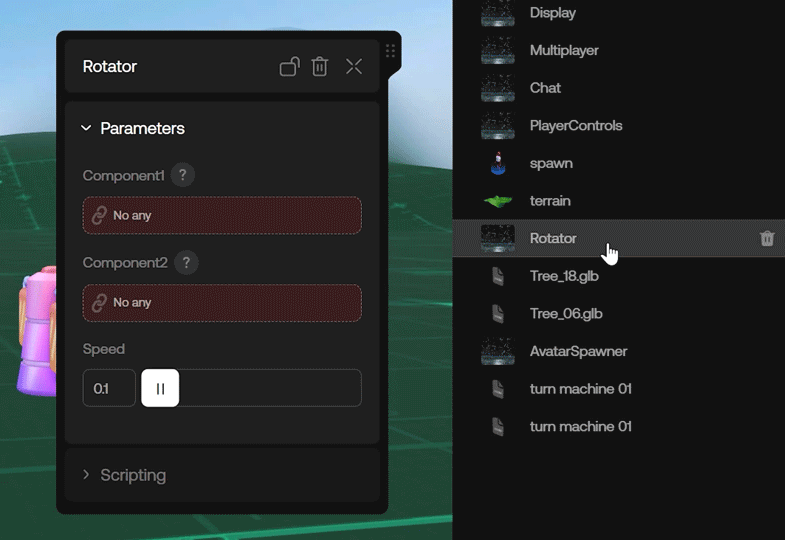

# Creating Custom Components

To create your own Custom Component, open the Script Editor, create a new script, and add the following:

```ts copy
import { ScriptComponent } from '@oo/scripting'

export default class ExampleComponent extends ScriptComponent {
    
}
```

Save the script, click Prefabs on the left, and select the Components tab -- you should see the name of your new Custom Component in the list:


You can click the new Custom Component to add it to your studio scene, but right now it's just an empty UI shell -- we still need to code the functionality.

> Note: you cannot delete a script that contains a behavior or a component if you have an instance of it in the scene

## Giving Components a Visible Position with Transform

By default, new Custom Components are "invisible" in the studio editor -- this means they do not innately represent a visible object with a position that you can move around in the studio the same way you would a 3D model.

If you want to enable that for a Custom Component, you can add a transform to its config:

```ts copy {4-6}
import { ScriptComponent } from '@oo/scripting'

export default class ExampleComponent extends ScriptComponent {
    static config = {
        transform: true,
    }
}
```

This will enable a movable position for the Component.

Let's add a basic cube to its position using Three.js:

```ts copy {1, 10, 12-18, 20-22, 24-16}
import { Object3D, Mesh, BoxGeometry, MeshStandardMaterial } from 'three'
import { ScriptComponent } from '@oo/scripting'

export default class ExampleComponent extends ScriptComponent {
    
    static config = {
        transform: true,
    }
    
    private mesh: Mesh

    onRenderInit() {
        this.mesh = new Mesh(
            new BoxGeometry(1,1,1),
            new MeshStandardMaterial({ color: "red" })
        )
        this.add(this.mesh);
    }

    onGetCollisionMesh(){
        return this.mesh
    }

    onRenderDispose() {
        this.remove(this.mesh)
    }
}
```

Since Components are Three.js objects, you can easily add simple geometry and target them using `this`.

Meanwhile, the line with `onGetCollisionMesh` allows your object to be selectable from the scene. This also allows it to take part in physics interactions if collision is enabled.

Keep in mind that if you add a mesh to a Custom Component, it's also important to define how the Component is removed from the scene.

If you don't define it, you will be able to delete the Component, but the cube will remain. The `onRenderDispose` segment above handles this.

If needed, Custom Components can also utilize different [lifecycle](./lifecycle.mdx) methods like `onUpdate`, `onStart`, etc.

## Additional Frontend Modularity With Parameters

Parameters allow you to add additional frontend modularity to a Custom Component by creating UX fields that a user can tweak in the studio, which are coded to affect the world in different ways.

For example, if you create a Custom Component called GameTimer that calls `World.stop()` to end the game after a certain amount of time has passed, you could add a '@Param' line to your code that allows the user to set that time on their own with a slider, ie:

```ts copy {1, 5, 6}
import { ScriptComponent, Param, Folder, World } from '@oo/scripting'

export default class GameTimer extends ScriptComponent {
    
    @Folder("Timer Settings", {})
    @Param({ type: "number", min: 0, max: 3600 })
    private time = 60;

    private timeout: any;

    onStart = () => {
        this.timeout = setTimeout(() => World.stop(), this.time * 1000);
    }

    onEnd = () => {
        if(this.timeout) clearTimeout(this.timeout);
    }

    onDispose = () => {
        if(this.timeout) clearTimeout(this.timeout);
    }
}
```

If you want to to detect when a Parameter has changed, you can use the `onRenderUpdate` method:

```ts copy {22-24}
import { Mesh, BoxGeometry, MeshStandardMaterial } from 'three'
import { ScriptComponent, Param } from '@oo/scripting'

export default class ExampleComponent extends ScriptComponent {
    
    static config = {
        transform: true,
    }
    
    @Param({ type: "color" })
    private color = "#ffffff";

    private mesh: Mesh;
    private mat: MeshStandardMaterial;

    onRenderInit() {
        this.material = new MeshStandardMaterial({ color: "red" });
        this.mesh = new Mesh(new BoxGeometry(1,1,1), this.mat);
        this.add(this.mesh);
    }

    onRenderUpdate() {
        this.mat.color.set(this.color);
    }

    onRenderDispose() {
        this.remove(this.mesh)
    }

    onGetCollisionMesh(){
        return this.mesh
    }
}
```

You can find a list of [available Parameters here](./reference/scriptparam.md).

## Detecting Studio Editor Mode

You may have noticed that Components also run from the Studio editor interface.

In some cases, you may want that Component to know whether the active user is currently in the Studio editor mode, or in the live in-world/end-user mode.

You can achieve this by making use of `Env.editMode`:

```ts copy {1, 6}
import { ScriptComponent, Env } from '@oo/scripting'

export default class ExampleComponent extends ScriptComponent {

    onRenderUpdate = () => {
        console.log("is in edit mode:", Env.editMode);
    }
}
```

## Component References

In some cases, your Components may need to reference other Components. For this, you'll want to use a special Component Parameter: `$Param.Component()`

Setting up a Component Parameter like this allows you to directly drag-and-drop a Component from the World Items list into a special input field (rather than having to specify an ID and then point to that ID).

For example, this script takes two objects and rotates them -- one clockwise and the other counter-clockwise:

```ts copy {1, 5-10, 13-14}
import { ScriptComponent, Param, $Param } from '@oo/scripting'

export default class Rotator extends ScriptComponent {

    @Param()
    component1 = $Param.Component("any");
    @Param()
    component2 = $Param.Component("any");
    @Param({ type: "number" })
    speed = 0.1;

    onUpdate(dt: number) {
        this.component1.rotation.y += this.speed * dt;
        this.component2.rotation.y -= this.speed * dt;
    }
}
```

Once this is set, you'll find a new Parameter indicating drag-and-drop functionality in the frontend UI of your Component:



If you want to set a Type restriction on the Component, you can do so by replacing "any" with a particular Type:

```ts copy {1, 5-8}
import { ScriptComponent, Param, $Param } from '@oo/scripting'

export default class MyComponent extends ScriptComponent {

    @Param()
    myAvatarParam = $Param.Component("avatar");
    @Param()
    myAudioParam = $Param.Component("audio");
}
```

This passes Type information to the Component's frontend UI enabling additional type-specific Parameters.

You can also use Component Parameter with other Custom Components you've made:

```ts copy {1-2, 6-7}
import { ScriptComponent, Param, $Param } from '@oo/scripting'
import MyOtherComponent from "./MyOtherComponent"

export default class Rotator extends ScriptComponent {

    @Param()
    myAvatarParam = $Param.Component(MyOtherComponent);
}
```

## Resource Parameter

In some cases you might just need the data from a Component -- for that, you can use a Resource Parameter.

For example, let's say one of your Components creates an Avatar in your experience by hardcoding it in a script with a specific URL.

If you'd rather make it easy to swap out that Avatar with one from the "Add assets" section in oncyber, you can use: `$Param.Resource()`

```ts copy {1, 5-6}
import { ScriptComponent, Param, $Param, Components } from '@oo/scripting'

export default class AvatarSpawner extends ScriptComponent {

    @Param()
    avatarData = $Param.Resource("avatar");

    public async spawnAvatar(x, y, z) {
        return await Components.create({
            type: "avatar",
            url: this.avatarData.url,
            position: {x, y, z},
            text: "Enemy",
        })
    }
}
```


> Tip: you can add Avatars this way from the Official, Uploads, or Owned tabs.

You can also use a Resource Parameter with audio files -- for example:

```ts copy {1, 5-6, 8, 11-15}
import { ScriptComponent, Param, $Param, Components, AudioComponent } from '@oo/scripting'

export default class AudioPlayer extends ScriptComponent {

    @Param()
    audioData = $Param.Resource("audio");

    private audio: AudioComponent;

    async onPreload(x, y, z) {
        this.audio = await Components.create({
            type: "audio",
            url: this.audioData.url,
            volume: 0.5,
        })
    }

    playAudio() {
        this.audio.play();
    }
}
```

## Group Params

Sometimes you may want to group Parameters together in a object for organizational purposes -- for example, to reuse a structure, or simply to lighten the number of Parameters in your class.

```ts copy {1, 3-9, 13-16, 19, 20}
import { ScriptComponent, Param } from '@oo/scripting'

class ColorPalette {
    @Param({ type: "color" }) primary = "#ffffff";
    @Param({ type: "color" }) secondary = "#ffffff";
    @Param({ type: "color" }) accent = "#ffffff";
    @Param({ type: "color" }) background = "#ffffff";
    @Param({ type: "color" }) highlight = "#ffffff";
}

export default class VisualComponent extends ScriptComponent {

    @Param({ type: "group"})
    night = new ColorPalette();
    @Param({ type: "group"})
    day = new ColorPalette();

    onRenderInit() {
        console.log("night primary color", this.night.primary);
        console.log("day highlight color", this.day.highlight);
    }
}
```

 > Group Params can contain other Group Params

## Component Triggers

Similar to Parameters, Components can also have buttons added to their UI elements that call functions when clicked:

```ts copy {1, 5-8}
import { ScriptComponent, Trigger } from '@oo/scripting'

export default class ExampleComponent extends ScriptComponent {

    @Trigger({ name: "My Button"})
    onButtonClicked() {
        console.log("button clicked")
    }
}
```

> Note: [Behaviors](./behaviors.mdx) can also use `@Trigger` to add a button to their Studio UI elements.

## Creating Presets for Components

When you have a lot of complex Parameters on your Custom Component, you may want to define presets to make it easier for other people to use.

Here's an example:

```ts copy {1, 28}
import { ScriptComponent, Presets, Param, Folder } from '@oo/scripting'

const PRESETS = [{
    name: "red",
    image: "https://...",
    data: {
        color: "#ff0000",
        text: "red",
    }
}, {
    name: "green",
    image: "https://...",
    data: {
        color: "#00ff00",
        text: "green",
    }
}, {
    name: "blue",
    image: "https://...",
    data: {
        color: "#0000ff",
        text: "blue",
    }
}]

export default class ExampleComponent extends ScriptComponent {
    @Folder("Presets")
    @Presets(...PRESETS)

    @Folder("Options")
    @Param({ type: "color"})
    color = "#000000";
    @Param({ type: "string"})
    text = "black";
}
```

> Note: [Behaviors](./behaviors.mdx) can also use `@Presets`.

## Config Options

Some additional config options for Custom Components include:

```ts copy {5-9}
import { ScriptComponent } from '@oo/scripting'

export default class ExampleComponent extends ScriptComponent {

    static config = {
        title: "Display Name",
        description: "description of the component",
        tip: "tip on how to use the component",
        singleton: false,
        draggable: true,
        transform: false,
    }
}
```

## Static Methods

Custom components have access to special static methods, which allow you to access all instances of a component like so:

```ts copy
const example_component = await ExampleComponent.create({
    color: "#ffffff"
})
const all_example_components = ExampleComponent.getInstances();
const main_example_component = ExampleComponent.getMain();
```