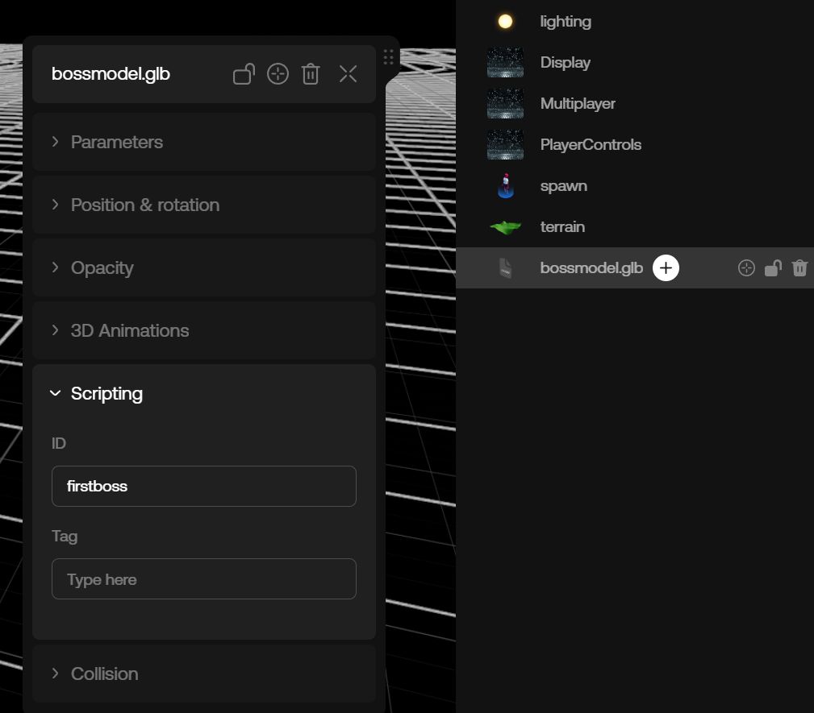
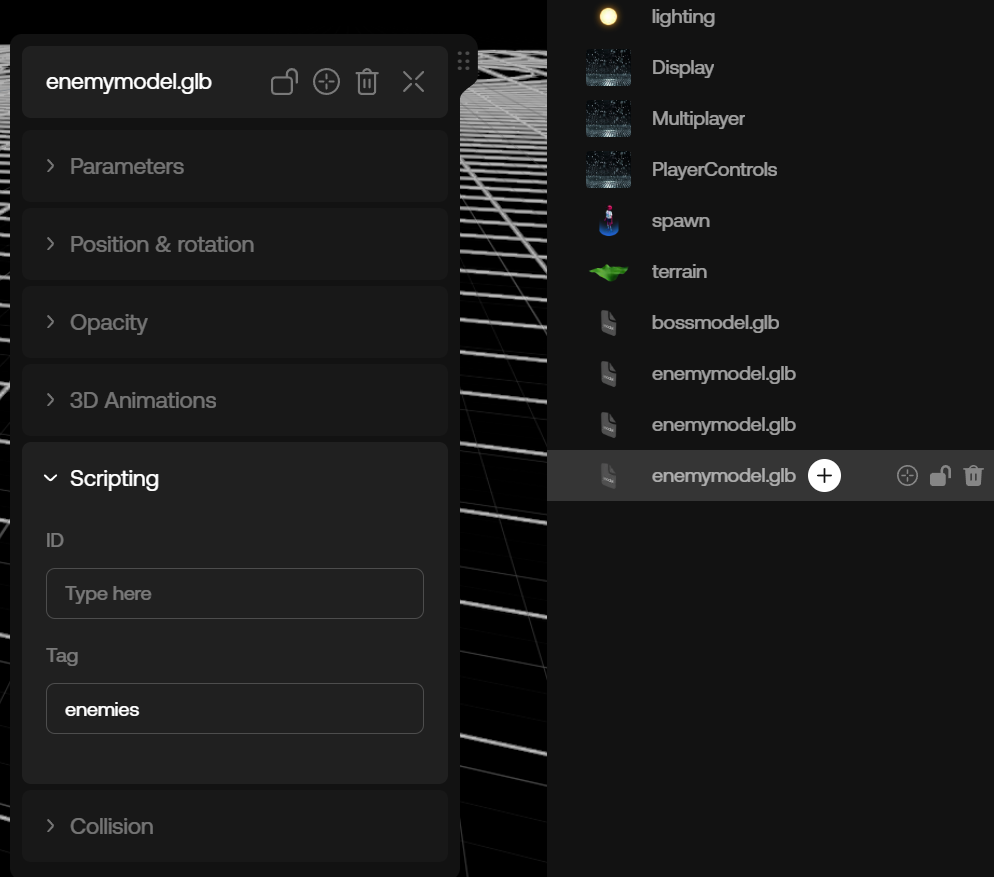

# Components Guide

## Introduction

Components are the fundamental building blocks that allow you to add content to any oncyber experience.

When you open the Studio editor for the first time, think of the elements you can add: 3D models, VRM Avatars, Images, Audio Assets, and Text, for example.

These are all Components. In fact, everything that can be added to an oncyber scene in the Studio editor is represented by a Component -- and you can even create your own (we call these [`Custom Components`](./components.mdx/)).

In the scripting API, all Components are represented by classes that share a common ancestor: [`Component3D`](./reference/component3d/).

## Managing Scene Components

The entrypoint to working with Components in oncyber is the [`Components variable`](./reference/components/). This is an instance of the [`ComponentManager`](./reference/componentmanager/) class, and it can be imported from the `"@oo/scripting"` package.

```ts copy
import { Components } from "@oo/scripting"
```

The `Components` instance contains all Components added to any given oncyber world. It is responsible for querying, creating, destroying, and duplicating Components.

Next, we'll explore some common paths to accessing Components to an oncyber world from within a script.

### Accessing a Single Component with a Scripting ID

When you add a Component to a scene in the Studio, you can also set a Script Identifier for that Component through its Studio UI.

To assign one of your Components a Scripting ID, select the Component, expand the Scripting folder, and enter a name in the ID field:



In the example above, we've used the name `firstboss` as the Scripting ID.

Now, this can be accessed in our script's code using the [`ComponentManager.byId()`](./reference/componentmanager/byid/) method:

```ts copy filename="main" {1, 5, 8}
import { Components } from "@oo/scripting"

export default class GameManager {

    firstboss = null

    onReady() {
        this.firstboss = Components.byId("firstboss");
    }
}
```

There are two important details here:

**1.** Note that we placed the code inside the `onReady` Lifecycle method. This is how we ensure that the Component has been loaded. It would be a mistake to place this code, for example, inside the `onPreload` Lifecycle method.

This is because it's not guaranteed that the Component has been loaded and created at that time in the [`Lifecycle`](./lifecycle.mdx). Loading Components at the wrong time can cause cascading errors in your code and break the ouput of your experience.

**2.** Scripting ID names are meant to be unique among Components, allowing you to identify specific Components using the name you've set -- this is why we've used "firstboss" in the example instead of something like "boss" which might refer to broader conditions we want to reuse.

This is related to how we access components with byId. Although nothing prevents you from having multiple Components with the same Scripting ID, if you do have more than one Component with the same Scripting ID, then use the byId method to try to retrieve them, it will only retrieve one. 

If you have certain conditions you want to access multiple components at once, you may want to use a Scripting Tag instead of a Scripting Identifier.

### Accessing Multiple Components with a Scripting Tag

Suppose you have multiple enemy models placed in a scene, and you want to access them all in order to apply some shared conditions.

In the oncyber Studio UI, you'd want to set the **same** Script Tag name for each of those (unlike the Scripting ID, which should be unique).

This field can be found directly below Scripting ID for any Component. In this example, we'll set the Scripting Tag to `enemies`:



In your code, you can access all Components tagged with that name using the [`ComponentManager.byTag()`](./reference/componentmanager/bytag/) method:

```ts copy filename="main" {5, 8}
import { Components } from "@oo/scripting"

export default class GameManager {

    enemies = null

    onReady() {
        this.enemies = Components.byTag("enemies");
    }
}
```

> Tip: Remember, a Scripting ID added through the frontend UI for a Component should typically be a unique name and should only be used when you want to access one specific Component, whereas a Scripting Tag can be reused, allowing you to easily associate and access multiple Components under the same name.

## Docs Companion: Remixable ID and Tag Component Guide Sample

For an example experience distilling the ID and Tag concepts that you can view and remix (to see the code and settings from the Studio side yourself), go here: https://v2.oncyber.io/componentsguidesample

### Accessing Components Without Setting a Script ID or Tag

Sometimes it might be tedious to set a tag for all Components; for example say you added a number of [Kit Assets](./reference/kitbashcomponent/) named `pickup*`.

You can get access all assets with a name starting with `pickup` with the following code:

```ts copy filename="main" {5, 8}
import { Components } from "@oo/scripting"

export default class GameManager {

    pickups = null

    onReady() {
        this.pickups = Components.filter(it => it.data.kitType?.startsWith("pickup"))
    }
}
```

There are additional helper methods that can be used to access specific Components. See the documentation for the [`ComponentManager`](./reference/componentmanager/) class for more information.

## Duplicating Components with Scripting

In a typical workflow, you'll be adding Components to the scene through the oncyber Studio interface. Now, suppose you have an enemy entity in your game that's represented as an [Avatar Component](./reference/avatarcomponent/). 

Unless you want that enemy to be unique (ie. in the case of a boss fight), you'll likely want copies. One approach is to make and place all enemy copies manually in the Studio yourself, directly adjusting the position for each.

Alternatively, you can take a more dynamic scripted approach and create a "template" object in the Studio, then use the scripting API to create more instances of the original.

In this example, we'll assume you added an Avatar Component and set its Scripting ID in the Studio to `enemy`. The following snippet shows how to create multiple duplicate instances of that avatar, randomly positioned in your scene:

```ts copy filename="main" {1, 5, 8, 10-13, 16, 20-24} /async/
import { World, Componens, Player } from "@oo/scripting"

export default class GameManager {

    enemies = []

    async onReady() {
        const enemyTemplate = Components.byId("enemy")

        for (let i = 0; i < 20; i++ ) {
            const enemy = await enemyTemplate.duplicate()
            this.enemies.push(enemy)
        }

        // hides the template
        enemyTemplate.visible = false
    }

    onStart() {
        this.enemies.forEach(enemy => {
            const posX = Math.random() * 100
            const posZ = Math.random() * 100
            enemy.position.set(posX, 0, posZ)
        })
    }
}
```

In the snippet above, we get our Avatar template using [`Components.byId`](./reference/componentmanager/byid/). We then call the [`Component3D.duplicate() method`](./reference/component3d/duplicate/) to create 20 copies. The copy will initially have the same state as the original one.

Note that we placed the duplicate code inside the `onReady` Lifecycle callback here since we're sure that all Components that were added in the Studio has been loaded and instantiated at this point in the [`Lifecycle`](./lifecycle.mdx).

Next, we use the `onStart()` Lifecycle callback to spawn the enemies at random position on the scene. Using `onStart` allows us to vary the spawn positions of the enemies on each game restart. If we wanted to keep the same positions accross restarts, we would place the positioning code in `onReady` instead.

> Note: you may recall the prior statement that Scripting Ids should be unique. In the example above, even though we're duplicating a Component that has a unique Scripting ID, it's only that first instance we're accessing with byId that we need to be concerned with.
>
> In this case, you can use an Id with a standard name like `enemy` since that Component's intended use is as a _template_ object for duplication; when the code duplicates the object, it will automatically assign its own unique Ids to the copies.
> 
> Since we don't need to access the created copies with byId, and instead we are only using the byId method to get the Component for initial duplication, we don't need to worry what the Id is for those copies past the point of duplication.

### Destroying Components

Sometimes, you may need to remove Components from your world, either as part of gameplay, or due to changes in the scene for other reasons. The `destroy` method allows you to remove a Component from the active scene.

For example, suppose we have various model components used to represent collectible coins. When a player collects a coin, we can remove the collected coin from the scene with syntax like this:

```ts copy
onCollectCoin = (coinModel: Component3D) => {
    coinModel.destroy()
}
```

## Creating Components

Typically, you'll be adding Components to a scene through the oncyber Studio interface. However, you can also use the scripting API to add Components dynamically at runtime.

To add new Components to your game with scripting, you can use the [`Components.create`](./reference/componentmanager/create/) method. This method allows you to instantiate a new Component directly in your scripts.

Each Component type has a specific data interface that defines its properties and behaviors when created. When creating a Component, you provide this schema to the `create` method.

This schema configures the initial state of the Component, setting up its characteristics such as size, position, color, or any other relevant properties.

For more detailed info on the data schema for each individual Component, see the API reference specific to that Component.

For example, to create a new 3D model component, you would specify the model file, its initial position, scale, and rotation in the game world:

```ts copy
const myModel = await Components.create({
    type: "model",
    url: "path/to/model.glb",
    position: { x: 0, y: 0, z: 0 },
    scale: { x: 1, y: 1, z: 1 },
    rotation: { x: 0, y: 0, z: 0 }
});
```

Some Components like `background` and `lighting` are singletons. Singleton Components can only be added through the oncyber Studio interface, and can only be added once per scene.

> Note: Certain default Components like `background` are required and thus automatically added when you create a new world in oncyber.

Understanding and utilizing Components effectively is the key to building rich interactive experiences in oncyber.

By mastering the creation, duplication, and destruction of Components, you can dynamically modify the world in response to player actions and game events in your experiences.

To learn how to build your own Components, see the [`Custom Components`](./components.mdx) guide.