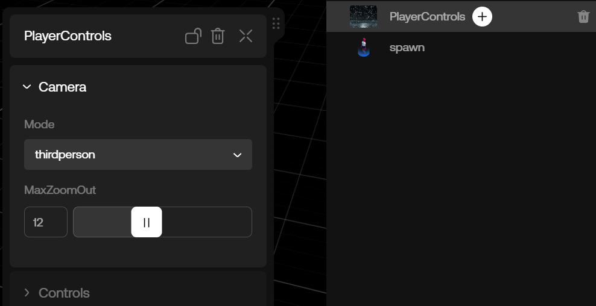

# Controls: Introduction

By default, avatar animations and the controls for an experience in oncyber are handled by the PlayerControls component.

Each time you create a new world from scratch in oncyber, an instance of the PlayerControls component will be added to the scene automatically.

By selecting the PlayerControls component, you can adjust the available modes and options.

Let's take a look at how the different frontend settings available in the default PlayerControls component affect the way an avatar controls.

## PlayerControls Settings: Camera Folder

### Mode:
Choosing firstperson or thirdperson sets the camera in an experience to the selected point-of-view for the user.

### MaxZoomOut:

This setting only affects thirdperson Mode, as firstperson has an innate MaxZoomSet to restrict the user to a first-person perspective.

In thirdperson Mode, the camera zoom is adjustable by using the mouse scroll wheel.

The maximum value set here is (as the name suggests) the maximum amount a user can zoom out with a mouse scroll wheel.

This is also the default starting camera zoom for the user upon loading into an experience.

Higher values start the camera further from the user, while setting this to the minimum value is similar to selecting firstperson for Mode.

## PlayerControls Settings: Controls Folder

### ControlsMode:

There are two different default control styles for the user: platformer and platformer2. As their names suggest, these default control styles are well-suited to platformer-style experiences.

The first is more straightforward, with just a few settings, while the second has an extensive range of settings, allowing for further finetuning of the user's avatar within the associated oncyber experience.