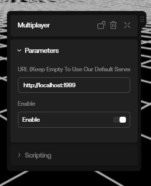
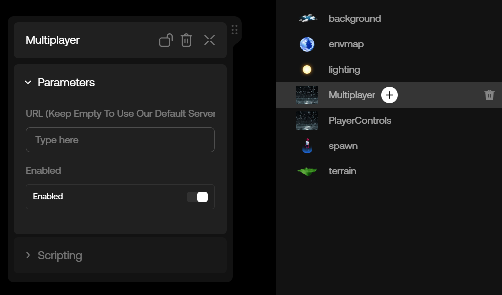

import { FileTree } from "nextra/components"

# Custom Server

If you want to customize the multiplayer behavior beyond player syncing, like making a game with some type of authoritative logic, you'll need to create your own multiplayer server and deploy it. In the next sections, we'll show you how to do that.

## Setting up the Server

Before we can update the server URL to use our own custom server, we need to first run the default server. To do this, we'll use our server library, which is a wrapper around the [PartyKit](https://www.partykit.io/) library.

This library will allow us to create a multiplayer server with minimal effort. For a quickstart, you can head to the following github repository and clone it to your local machine:

```bash copy
git clone https://github.com/oncyberio/oo-game-server-starter
```

This will create a new folder called `oo-game-server-starter` in your current directory. You can then navigate to this folder and install the dependencies by running the following commands:

```bash copy
cd oo-game-server-starter
npm install
```

Once the dependencies are installed, you can start the server by running the following command:

```bash copy
npm run dev
```

This will start the server on port `1999`. Now that the server is running, we can update the server URL.

## Connecting a Custom Server to the Multiplayer Component

We'll explain later how the server works, but for now, let's just update the URL of the multiplayer component:



Now, when we run our game, it'll connect to our custom server instead of the default server.

You can test this by opening two browser windows: one in your current browser session, and one that is incognito/private. Next, open the game in both windows -- you can get the game link by clicking the "Preview" button in Studio mode.

If you put the windows side-by-side, you should be able to see that movement from the player in the first window is replicated in the second window, and vice versa.

## Deploying a Custom Server

Currently, our custom server is running locally. To make it available to the public, we need to deploy it.

To deploy the server, simply run the following command:

```bash copy
npm run deploy
```

Next, follow the instructions in the console. After deployment is complete, a URL to your server will be provided. You can enter that URL in the Multiplayer Component field here:



Now, if you share your game with your friends, you should be able to play together using your custom server.

## Understanding our Server Architecture

Now that we have a server running and we know how to connect to it, let's take a look at how it works.

<FileTree>
    <FileTree.Folder name="src" defaultOpen>
        <FileTree.Folder name="types">
            <FileTree.File name="Player.ts" />
            <FileTree.File name="RoomState.ts" />
            <FileTree.File name="utils.ts" />
        </FileTree.Folder>
        <FileTree.File name="room.ts" />
        <FileTree.File name="server.ts" />
    </FileTree.Folder>
    <FileTree.File name=".gitignore" />
    <FileTree.File name="README.md" />
    <FileTree.File name="package-lock.json" />
    <FileTree.File name="package.json" />
    <FileTree.File name="partykit.json" />
    <FileTree.File name="tsconfig.json" />
</FileTree>

Let's explore the most important files in more detail.

#### package.json

There are a four dependencies needed to run our server:

-   `@colyseus/schema`: [@colyseus/schema](https://github.com/colyseus/schema) is used to create schemas and manage our multiplayer room state.

-   `@oogg/game-server`: This library provides abstraction over the [PartyKit](https://www.partykit.io/) library making it easier to create a multiplayer room for oncyber.

-   `@oogg/rapier3d-compat-cfworker`: For the physics engine, we use [Rapier](https://rapier.rs/). To make it work with Cloudflare Workers, we use this library.

-   `three`: This is our own version of the [three.js](https://threejs.org/) library. It's a fork of the official [three.js](https://threejs.org/) library with some modifications and new features.

##### partykit.json

This file is used to configure the [PartyKit](https://www.partykit.io/) library. You can read more about it [here](https://docs.partykit.io/reference/partykit-configuration/).

##### room.ts

In this file, we define our multiplayer room behavior. You can customize the room behavior by setting room properties and implementing some callback methods, ie:

```ts copy
export class MyRoom extends GameRoom<RoomState> {

    // Properties

    tickRate = 30
    // ...

    // Callback methods

    onPreload() { ... }

    onJoin(player) { ... }

    onMessage(message, player) { ... }

    // ...
}
```

Let's look at some customization options available for the class:

###### Properties

-   `tickRate` : defines how often the state is synchronized with the clients.

-   `state` : room state.

-   `maxPlayers` : max number of players that can join the room.

-   `simulatedLatency` : in milliseconds, used to simulate network latency when using a local dev server.

-   readonly `status` : Game loop status, can be `"idle"` or `"running"`.

###### Lifecycle Methods

-   `onPreload()` : is called before any client connection is made. Use this to define room initialization that needs to run only once.

-   `onJoin(player)`: called when a player has beed added to the room. Use this method to initialize player states like spawn position, etc.

-   `onLeave(player)` : called when a player has left the room.

-   `onRequestStart` : called when the room host requests a game start; this is the default implementation. You can call the `startGame(countdown)` here to notify clients that the game will start in `countdown` seconds.

-   `onMessage(message, player)` : when a message is received from a client script.

-   `onUpdate(dt)` : called on each tick of the game loop. This is only invoked after you invoke `startGame`.

-   `onDispose` : called when the room is disposed. The room is disposed when all players has left.

###### Room Methods

-   `broadcast (msg, except?)` : sends a message to all players. You can exclude some in the seconds argument (player ids).

-   `send (msg, playerId)` : Sends a message to a single client.

-   `startGame(countdown)` : Starts the game after `countdown` seconds. Notifies clients, taking into account the nework latency for each player. This is usually called in the `onRequestStart` handler method.

-   `stopGame()` : Stops the game loop, and notifies all clients. Call this when the game ends by reaching the max time, or reaching another win/lose condition.

###### `types` folder

The room state is defined in src/types folder; the default template includes a preset for players and a game timer.

You can extend the template by adding properties to the relevent class. Every property must be annotated with a @type(...). This is needed so that the room server can efficiently serialize the state over the network.

Currently we use `@colyseus/schema` package for state definition and serialization. See https://docs.colyseus.io/state/schema/ for more information.

To add player specific attributes, add the relevent properties to the `Player` class.

To add general game attributes, add the relevent properties to the `RoomState` class.

The state is synchronized regularly for all client scripts; you can customize the rate in `src/room.ts` by setting the `tickRate` property.

> It's important to not delete the current state properties defined in this template (like players, etc) since they're used internally by the multiplayer package.

## Future Plans

Currently, multiplayer is in its early stages, with a number of improvements planned. Here are some of the features we're working on:

-   **In Studio Server-Side Scripting**: We're working on adding support for server-side scripting in the Studio. This will allow you to add server-side logic without having to deploy your own server, or working externally from the Studio.

-   **Support for More Providers**: Currently we only support [PartyKit](https://www.partykit.io/), but we're working on adding support for other providers like [Colyseus](https://colyseus.io/).
