# Flappy Bome Remix Guide

## Introduction

Welcome to the Thunderbome: in this remix guide, you'll learn how to put your own Flappy spin on the Bome.

To get started, [go to Flappy Bome in your browser](http://v2.oncyber.io/flappybome) and click the "Remix" button in the lower-right hand corner of the opening screen:

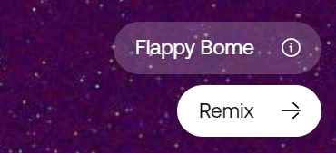

This will take you to the Studio, where you'll find an identical copy of the game with its settings, components, and scripts available for you to remix.

## Flappy Bome Remix Studio UI

First, let's take a look at some of Flappy Bome's key UI sections in the Studio editor interface:

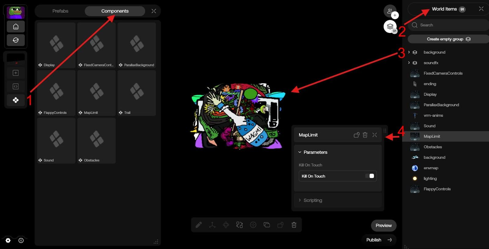

### Key Sections:

**1\) Custom Components**

In addition to the boilerplate Components in this tab that come with any new experience \(ie. Display\), you'll find several Custom Components in this tab unique to the Flappy Bome remix.

**2\) World Items List**

This right-hand panel will be minimized when you first enter the Studio, but can be expanded by clicking the icon with three diamonds stacked on top of each other in the top-right of the Studio UI. Here, you'll find any Components that have been added to the scene through the Studio interface.

**3\) Grouped Background Assets**

When you remix Flappy Bome, you'll find all background art assets grouped together at the center of the Studio scene. Expand the "backgrounds" Group in the World Items list to browse and select assets. Note that any visual assets added to this Group will be randomly placed on the scene's background during gameplay (via the "ParallaxMemes" Behavior).

**4\) Custom Component UI Example**

When you select one of the Custom Components in the World Items list, a UI panel will open with various frontend settings that can adjust functionality without requiring Script/code edits.

Though you're likely to use other sections of the Studio UI in your remix, these are the main areas to note with custom content unique to the Flappy Bome game.

> Tip: If you're new to oncyber \(or you'd just like to learn more about how the Studio interface works in general\), it may be helpful to pause here and read through our beginner guides, starting with [how to use the Studio UI](https://docs.oncyber.io/guides/studio).

In general, the elements you can remix for Flappy Bome fall into two categories: Aesthetics and Mechanics. There will be some overlap between the two, but we'll start with Aesthetics.

## Remixing Aesthetics

### Background Art Placement

In the World Items list (#3 in the screenshot above), you'll see "background" at the top next to a ">" and a two-stack version of the World Items icon.

This indicates a set of Components that have been added to a Group -- click the icon to expand this Group and access its contents.

Inside, you'll find a number of Image Components (all those dank memes you're flapping by) and a single line of purple text that says "ParallaxMemes" accompanied by a branching node icon -- this is a Behavior.

Any images placed in the "background" Group will be arranged at random on the scene's background during gameplay. This is accomplished through a combination of that Behavior's frontend UI settings and the corresponding code behind it (accessible in the Script editor). 

If you click that Behavior, its frontend UI settings panel will open next to the World Items list. Let's take a look at the frontend UI settings first:

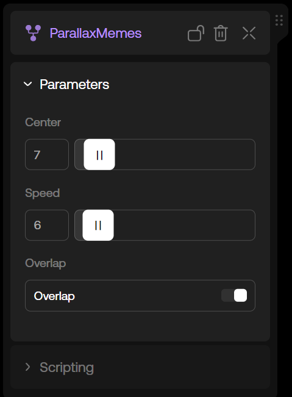

**Center:** this slider affects the vertical offset that is added to the random spawn position of art in the "backgrounds" folder, starting from the center of the screen; higher values = lower on-screen placement.

**Speed:** the value here allows you to control how quickly art spawns and moves from right to left through the scene. At 0, assets in the "backgrounds" folder will never spawn. At 100, the memes will flash past faster than your net worth in 2022. ¯\\\_(ツ)\_/¯

**Overlap:** if this is toggled on, art will overlap other pieces at random. Toggle this off to add space between each art piece during placement.

> Tip: you may note that all default Flappy Bome assets added to the "backgrounds" folder end with a .PNG extension. A .PNG file allows transparency in an image, making for some interesting collage-style art curation at random when Overlap is toggled on. If you're mostly using .JPEG files in your remix, you may find a better viewing experience at lower speeds with Overlap toggled off.

### Adding New Art

Ready to leave the Flappy Bome memes behind and add some new image assets of your own? EZ Flap:

First, delete any existing image components that you no longer wish to appear in your remix from the "backgrounds" folder by hovering over an asset and clicking the Trash Can icon at the right:

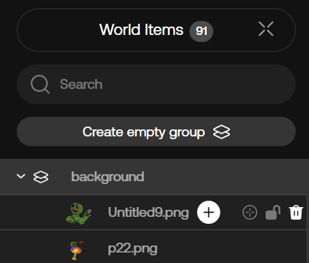

> Tip: to remove components from the World Items panel in bulk, you can select more than one at once by using Shift-Click (or Ctrl-Click to select several one-by-one), followed by Delete on your keyboard.

Once you've removed any existing images you no longer want in your scene, it's time to add your own. These can be added from the Uploads or Owned tab:

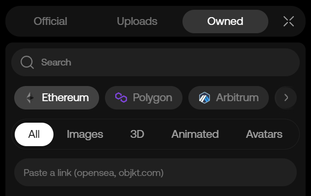

**Uploads:** a persistent library of files unique to your account. You can add to this over time by uploading files from your computer.

**Owned:** NFTs you own in wallets from different chains that you've connected to your oncyber account.

> Tip: adding your own images to a Flappy Bome remix can be a fun, easy way to showcase new art as a gamified gallery tour.

The fastest way to add new art to the randomized background pool in your Flappy Bome remix is to click and drag the desired asset into the "background" group in the World Items list.

You can also click to add the desired asset to your scene from either tab, where it will then be added to the bottom of the World Items list, with a position in your scene based on the current perspective of your camera in the Studio. Keep in mind that with this method, you'll need to drag it into the "background" group in the World Items list if you want it to be affected by the ParallaxMemes Behavior.

> Note: although there's technically nothing preventing you from adding .GLB 3D model files to the "background" folder, it's not recommended -- the Flappy Bome remix wasn't made with these in mind, and adding them may break your remix in unexpected ways, forcing you to debug manually or start again from scratch. Move beyond the base functionality at your own risk -- it's your remix, Flapper.

**Changing the Background**

Pining for a fresh view while you flap? You can swap this out by selecting the "ParallaxBackground" Custom Component from the World Items list at the right. There are two settings of note in its UI:

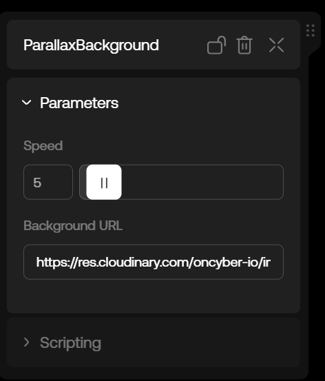

**Speed:** how quickly the background image scrolls from right to left. The default is 5, which makes for a pleasant pace. Significantly higher speeds may have adverse effects on recently digested meals.

**Background URL:** a direct link to the image you want to use as your new background. Sizing your image to a resolution of 1920px wide by 1080px tall (like the original background) is recommended.

> Tip: images that wrap seamlessly from one side to the other will look best here -- an abstract texture similar to the source image, for example, or a 360 skybox image without notable landmark distortion.

### Adjusting Obstacle Flavor

If repeatedly crashing into red candlesticks is starting to feel too real (Guh), you can give your nemeses a spiffy new look in the "Obstacles" Custom Component UI.

First, click "Obstacles" in the World Items list and open the Parameters folder.

Since we'll be getting to the Remixing Functionality later in this guide, there are only a few fields you need to be concerned with for now:

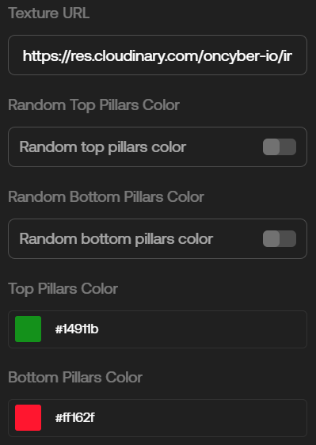

**Texture URL:** similar to the ParallaxBackground Custom Component, the URL entered here will be used as the texture wrapped around the obstacle pillars. A 500px square image (like the source) is recommended (as is a design that seamlessly wraps back into itself at the edges, where possible).

**Random Top Pillars Color/Random Bottom Pillars Color:** if either toggle is enabled, that pillar will appear as a different color each time it spawns. Crayon eaters, rejoice: there's a distinct sense of nostalgia to be found here. Mmm, wax...

**Top Pillars Color/Bottom Pillars Color:** if either toggle above is disabled, you can choose the specific color to be overlaid on the texture above. If you know the color hex you want, you can enter it in the text field -- if not, just click the color to use our handy-dandy eyedropper and find the perfect shade of pole.

### Changing the Title and Context Menu Text

You'll note that your remix is called "Flappy Remixer" by default. If you've got a spiffy title you'd like to replace that with, click the "Display" Component in the World Items list and expand the Parameters Folder:

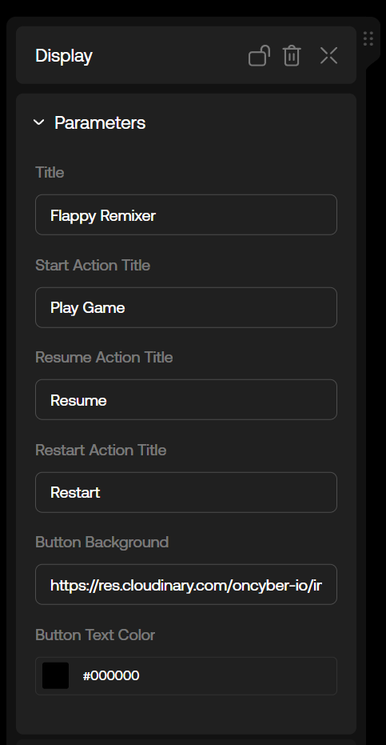

The contextual text options here should do what it says on the tin. For example, if you want to change the "Play Game" text to something like "Let's Dive In!" (#1 among LLMs), just replace the text in that field.

You can even replace the button background with one of your own design if you like -- just replace the link with your own image (a size of 183px wide by 73px tall is recommended to match the source dimensions).

## Remixing Mechanics

Got your flapscape painted up nice and pretty? Good -- now, it's time to decide what fresh hell (or chill, vibey stroll through the park) you want to put your fellow flappers through.

To remix the mechanics, we'll mostly be looking at the frontend settings available in several Custom Components.

### A Carefully Controlled Flap

As a 2.5D side-scrolling game, Flappy Bome has its own controls scheme, separate from those included with the standard Avatar-based 3rd-person experiences.

To adjust how the player flies (or falls), open the FlappyControls Custom Component in the World Items list and expand the Parameters Folder:

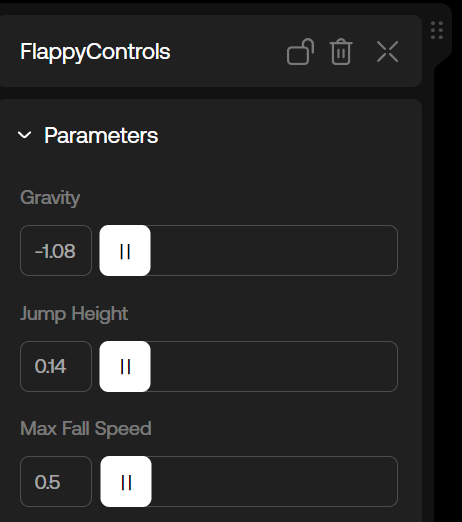

**Gravity:** negative values with higher numbers put the "rock" in rocket, while higher positive values let you cosplay as a balloon (a little goes a long way with this slider).

**Jump Height:** add a little pep to your step with a decimal point or two (anything more than that is overkill -- literally).

**Max Fall Speed:** gravity acceleration effect -- generally less impactful than the other two settings above, given the limited scene height.

### Adjusting Obstacles

You know those freshly-painted pillars of yours? Let's see what else they can do.

Open the Obstacles Custom Component UI again. We'll take these one-by-one (skipping past the Aesthetics fields covered above):

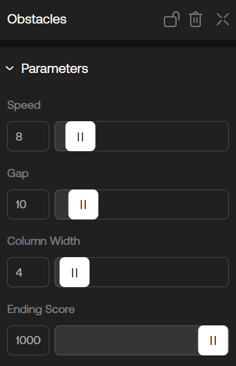

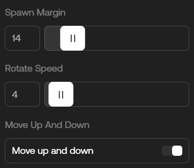

**Speed:** like life, pillars come at you fast(er, the higher this is set). Thought the OG version was hard? The slider was set to 8. It goes up to 100. Good luck. 

**Gap:** this determines the amount of space between pillars. Lower values make it harder (to the point of being impossible), while higher values eventually prevent pillars from spawning at all.

**Column Width:** from deathly straws to chonky dinner plates of doom, the value here dictates just how much horizontal space on your screen each pillar obstacle will take up.

**Ending Score:** want to spread feelings of exhilaration and accomplishment with your Flappy Bome remix? Definitely don't set this to 0, then (you troll). When a player reaches the value this is set at, they'll be greeted by a launch pad instead of another pillar, signifying sweet, sweet victory at last.

**Spawn Margin:** adjust this slider to set the distance between pillars. 

**Rotate Speed:** arguably more related to aesthetics than mechanics, setting this to 0 disables the pillars' spin, while setting it to 100 is... probably going to give someone a headache. Use this slider responsibly, please.

**Move Up and Down:** if this is disabled, pillars will no longer move up/down in a drill-type motion -- think of it as an "easier mode" toggle.

> Tip: you may notice that adjusting one slider can make your Flappy Bome remix impossible to play, very quickly. The trick to a good remix which adjusts the mechanics lies in a combination of settings -- for example, if you increase the Speed, or reduce the Gap, make sure to increase the Spawn Margin so the player has a fair chance to reposition themselves for that increased challenge. Remember: there's a fine flap between "hard yet fun" and "literally impossible."

### Adjusting Border Interactions

Ever wonder what would happen if you didn't crash each time you hit one side of the screen? There’s a Custom Component for that -- meet MapLimit:

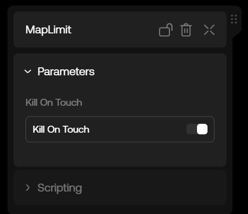

If this is disabled, the game won’t end once you hit the bottom or top of the screen -- only once you hit the obstacles. While this can be thought of as another "easier mode" toggle, intrepid remixooors might note some interesting potential here, in tandem with some of the more Advanced Techniques.

Try this: turn off Kill On Touch, increase Gap to a high value, and let Flappy drop to the bottom of the screen -- suddenly the game has a different feel, doesn’t it?

Surfing game? Skateboarding game? Endless runner? With some scripting and an aesthetic twist here or there, you’re looking at the potential for a much larger gameplay shift, remixed from a solid foundation.

Now, speaking of Advanced Techniques...

## Advanced Techniques

If you've made it this far through the Flappy Bome Remix Guide, it's safe to assume [you've got some dog in you](https://docs.oncyber.io/guides/remixing). However, if you haven't read our [Getting Started guide](https://docs.oncyber.io/guides/getting_started) yet, it's recommended you start there, as that will introduce you to the fundamentals of Scripting with oncyber.

### Changing the Player Avatar

Since Flappy Bome is a custom side-scrolling experience that does not use the standard default Avatar Component or Controls, you'll be using the Script editor to change the default player model.

This is a simple URL swap in the code, but you'll need the URL of the .VRM avatar you want to change to. 

To find the line you need to replace to change out your Avatar, open the Script editor in the Studio UI, and select the "main" file from the list of scripts on the left.

Near the top at line 27, replace the URL in quotes with a link to the .VRM you want players to use in your Flappy Bome remix:

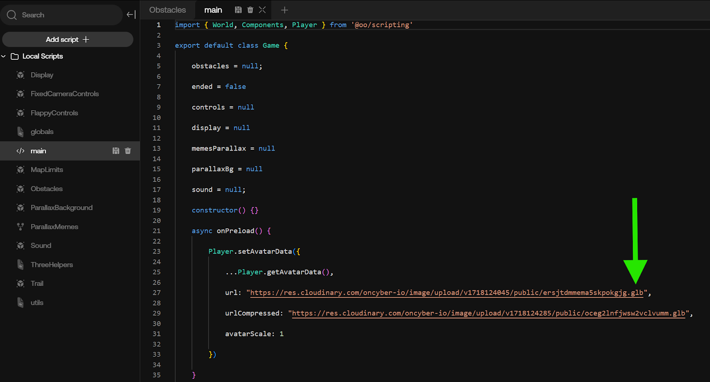

> Note: though the existing script uses a .GLB model as the player character, you’ll want to replace this with a URL pointing to a rigged .VRM file.

## Adding Your Own Sounds

If you want different sounds to trigger through different contextual actions, open the "Sound" script in the Script editor.

From lines 27 to 42, you'll see several lines related to audio Components:

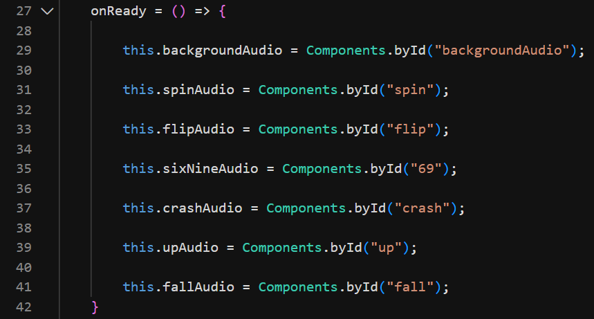

Next, open the "soundfx" Group in the World Items list and click one of the sound files there, then expand the Scripting folder in the component's UI:

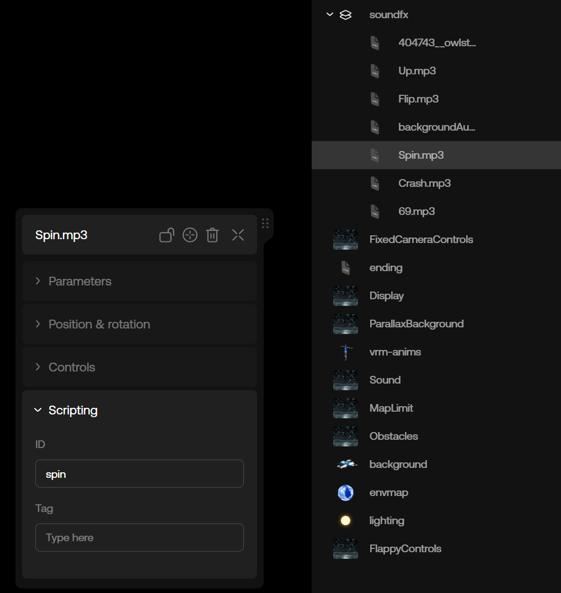

You'll note that "ID" is set to "spin," which corresponds with one of the lines in the "Sound" file script -- this is how the Script editor finds the audio component that should be associated with a given action.

To replace the various audio files with sounds of your choice, simply remove any audio files you don't want from the "soundfx" Group, upload your own, add them to the Group, and make sure to add the corresponding Scripting ID to your new sound for the file you're replacing.

For example, if you're replacing the "spin" sound, you would add the text "spin" to the Scripting ID of your new sound file after deleting the old one. Since the current script is getting the sounds by their Scripting ID, the file name doesn't matter -- only what you enter in the ID field.

If you've done this correctly, the next time you preview your remix, you should hear the replacement sound when your flapper spins.

## Going Deeper with Remix Functionality

Want to dig even deeper with your Flappy Bome remix functionality? Check out [our guide for working with the oncyber Scripting GPT](https://docs.oncyber.io/guides/gptguide) and [join us in Discord](https://discord.gg/NCuAWD4FCz) -- we're here to help you flap your way to creative bliss!