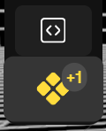
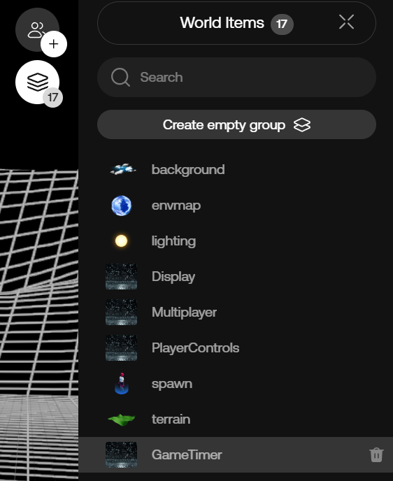
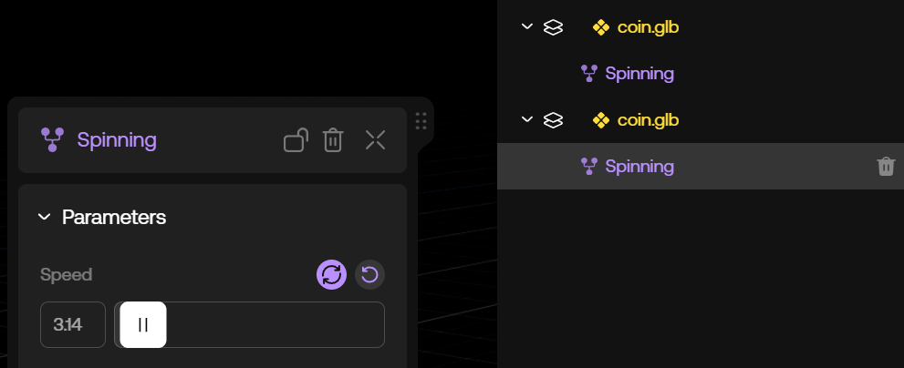
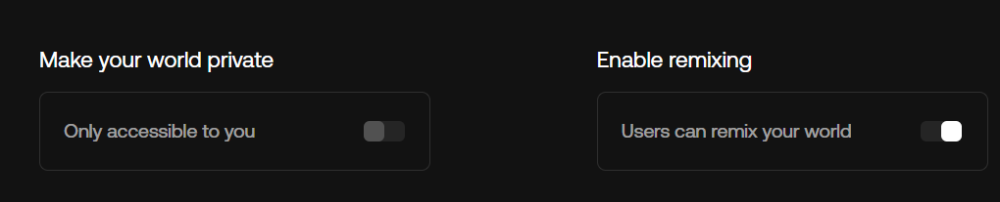

# Scripting Deep Dive

## Introduction

This guide aims to serve as an introduction to scripting with oncyber, and is paired with a demo game experience as a working example.

Before we get started, please note that if you're not familiar with oncyber's Studio UI, we recommend checking out the [Studio UI Guide](./studio.md).

If you'd like to see what that looks like first, [go here](https://v2.oncyber.io/play/rzO2PQ7IF7rXSXs8zUvh?draft=true).

To see how the demo game has been set up, simply click the "Remix" button and a duplicate copy will be added to your account.

This will allow you to see the exact Studio UI settings and scripted code used as a reference point.

> Tip: Any changes made will be unique to the copy in your account from the point of duplication, so feel free to put your own spin on the demo game!

## Planning the Structure for a Game or Experience

Before you start creating a game or experience in oncyber, it can be a good idea to map out the types of functionalities you'll need.

This will allow you to determine what needs to be coded as a [Custom Component](../components.mdx) or a [Behavior](../behaviors.mdx).

We'll use the demo game above as a live use case. The goal here is to create a game with three core elements:

- A timer that ends the game after reaching 0

- Collectible coins that appear and disappear at random throughout the game world

- System that keeps track of the player's score and displays it through an on-screen UI

## Let's Dive In

To get started, select "Worlds" from the top-left menu and choose the "Create from Scratch" option:


### Game Timer

Since the timer functionality needs to be a global object (meaning it needs to be available to all parts of your code), we'll make it a [Custom Component](../components.mdx).

First, open the Script panel on the left:


This will open a window with several boilerplate scripts. Clicking the "+" icon at the far-right of the tabs will create a blank script file called `Untitled1.tsx`:


Click the new script's name and change it to `GameTimer`, then enter the following code in the editor window below:

```ts copy filename="GameTimer"
import { ScriptComponent } from '@oo/scripting'

export default class GameTimer extends ScriptComponent {
    
}
```

oncyber uses [TypeScript](https://www.typescriptlang.org/) as its scripting language. Typescript is an additional syntax for [JavaScript](https://developer.mozilla.org/en-US/docs/Web/JavaScript), allowing it to handle types.

> Tip: The default .tsx extension can be removed from file names to keep things simple, without any negative impact.

After saving the script, you'll see the Prefabs button at the left light up with a +1 icon, signifying that a new Custom Component has been created:



Click the Prefabs button and choose the Components tab, where you'll find the newly created GameTimer component -- this can be added by clicking the "+" icon on hover, or dragging and dropping it into your scene:


For now, you will only be able to select it from the World Items list. To expand this and view all current components in your scene, click the icon in the top-right corner, which shows all current components:



At the moment our GameTimer Custom Component is just an empty UI container. Our next goal is to add code that starts a timer when the user loads into the experience.

When the timer ends, a method will be called that stops the experience, creating a clear game loop with a beginning and an end.

For this, we'll take advantage of oncyber's [Lifecycle](../lifecycle.mdx) for games. Let's add a couple lines to our script to start:

```ts {1,4, 6-8, 10-12, 14-16} /, World/ copy filename="GameTimer"
import { ScriptComponent, World } from '@oo/scripting'

export default class GameTimer extends ScriptComponent {
    private timeout: any;

    onStart = () => {
        this.timeout = setTimeout(() => World.stop(), 10000);
    }

    onEnd = () => {
        if(this.timeout) clearTimeout(this.timeout);
    }

    onDispose = () => {
        if(this.timeout) clearTimeout(this.timeout);
    }
}
```

To take what's happening in the added code step-by-step:

1) First we have the `onStart` method. This function is called when the player starts the game. Inside this function we create a 10s timeout at the end of which we call [World](../reference/space.md).stop(), which tells the engine that it's time to stop the game and send the player to the Game Over screen.

2) Once the game is over, the `onEnd` function is called, and code within this Lifecycle method is executed. Here, we're clearing the timeout in case we stopped the game earlier from another script.

3) The `onDispose` function is called when the component is removed from the scene or when the space is cleared, so it's better to also clear our timeouts and events here.

If you click on the preview button in the bottom right corner, you can test the functionality of the code you've added so far.

After 10 seconds you should see a Game Over menu like this:


Next, let's make it easier to change the length of our game by making the timeout duration a `@Param`.

Adding a [Param](../reference/param.md) to a Custom Component or Behavior allows users to change designated settings without actually having to dig into the code by adding frontend settings to a Custom Component or Behavior's UI.

Update your script with the following code and save it:

```ts {1, 5, 6, 11} /this.time * 1000/ /, Param/ copy filename="GameTimer"
import { ScriptComponent, Param, Folder, World } from '@oo/scripting'

export default class GameTimer extends ScriptComponent {
    
    @Param({ type: "number", min: 0, max: 3600 })
    private time = 60;

    private timeout: any;

    onStart = () => {
        this.timeout = setTimeout(() => World.stop(), this.time * 1000);
    }

    onEnd = () => {
        if(this.timeout) clearTimeout(this.timeout);
    }

    onDispose = () => {
        if(this.timeout) clearTimeout(this.timeout);
    }
}
```

Select your GameTimer component in the Studio -- you can now easily tweak the game's duration from the frontend:


###  Spinning Coins

Now that we have a game Lifecycle in place, we need to add an objective. In this demo game, we'll make that collecting coins.

For the purpose of this guide, download this 3D <a href="https://cyber.mypinata.cloud/ipfs/QmfZMBPMYiiBtz3Ekz8Ck7pqTXPiaPw4VGvvQXcSFQVbMo?filename=coin.glb" target="_blank" rel="noopener">coin model</a> asset, upload it to oncyber, and place it in your scene.

> Tip: As a shortcut for adding new assets, you can simply drag a file into an open Studio window. This will add it to your account in the Uploader section, as well as where you've dropped it in your scene.

To take the coin from a static model to an interactive game mechanic, we'll need to attach a piece of code called a [Behavior](../behaviors.mdx).

To create a Behavior, open the Script editor and create a new file named "Spinning" with the following code:

```ts copy filename="Spinning"
import { ScriptBehavior } from '@oo/scripting'

export default class Spinning extends ScriptBehavior {
    
}
```

> Tip: Without configuration the Behavior's name is pulled from the class name, not the filename in the script editor. It can be a good idea to use the same name in both places for organizational purposes.

After saving the script, you'll be able to attach your new Behavior to the coin model.

Once a Behavior has been created in a new studio scene for the first time, hovering over a component in the World Items list will bring up a "+" button to the right of that component's name.

Clicking that "+" button allows you to choose a Behavior and attach it to the component you've selected:


Now that we've attached a Behavior to the coin model, we'll need to code some functionality. Let's start by making the coin spin.

Just like Custom Components, you can create parameters using `@Param` to enable different types of customization settings through the frontend.

Here, we'll create a parameter that makes the coin rotation speed adjustable through the frontend:

```ts {1, 4, 5, 7-9} /, Param/ copy filename="Spinning"
import { ScriptBehavior, Param } from '@oo/scripting'

export default class Spinning extends ScriptBehavior {
    @Param({ type: "number", step: 0.1 })
    private speed = 0.5;

    onUpdate = (deltaTime: number) => {
        this.host.rotation.y += deltaTime * this.speed;
    }
}
```

Note how the object or Component that a Behavior is attached to can be accessed by using `this.host` in the code.

Since the onUpdate [Lifecycle](../lifecycle.mdx) method is called for every frame of the game, this is where we'll want to add our animation.

Before duplicating this coin let's make it a [Prefab](../prefabs.md). This will package the coin model component and Behavior together in their current state, and allow us to edit all coins at once.

To do this we need to enable the Prefab option:


Now if we duplicate the coin, then change the value for the speed of one, we see two icons appear:



The left icon applies the changes to the other components associated with the same Prefab (in this case, the other coin), while the right icon resets the parameter to its previous value.

In order to be able to interact with the coins we need to enable their collider. This can be done in the frontend for components like assets by default.

Select the coin, expand the Collision folder at the bottom of its UI settings, and enable the Collider toggle.

> Tip: By default, enabling a Collider will select the Mesh option, which means collision events will correspond with that model's geometry. This creats a higher performance cost for complex meshes. Selecting a simple collider like a Cube or Sphere when possible can help improve performance.

Now the player will collide with the coins -- but we don't want that, as otherwise the player won't be able to intersect with them for collection -- so let's enable the Sensor toggle.

Setting this as a Sensor will allow the player to pass through the coin model while still registering a collision event when they intersect.

If the coin is a duplicate of another prefab, remember to apply your settings once you add a Collider so it takes effect on all:


###  Collectible Coins

Next, let's make the coins collectable.

For this we're going to make another behavior that we will call Collectible.

Create a new script and add the following code:

```ts copy filename="Collectible"
import { ScriptBehavior, Param, Player } from '@oo/scripting'

export default class Collectible extends ScriptBehavior {
    
    private pickable = true;

    onStart = () => {
        this.pickable = true;
        this.host.visible = true;
    }

    handleSensorEnter = (collision) => {
        if(collision.other !== Player.avatar) return;
        if(!this.pickable) return;
        this.pickable = false;
        this.host.visible = false;
    }
}
```

Using the handleSensorEnter function, we can detect when the player collider with the coin and hide it once that sensor event occurs.

You can find more informations about physics functions like this [here](../physics.mdx).

We also need to reset the coin's visibility and state when the game starts, since we want the coins to reappear when starting a new game. This is being handled in the onStart [Lifecycle](../lifecycle.mdx) method.

Components can have more than one Behavior attached. Before moving on, attach this new Behavior to the coin model as well.

This will give the coin two independent Behaviors: one that makes it spin, and one that makes it collectible.

After you add it to your coin model, don't forget to apply the change to your Prefab so that all are affected.

###  Score System

Similar to the GameTimer, we'll need a score system that's globally accessible. This means we'll need to create another Custom Component. 

Create a new script and name the file `ScoreManager` then add the following code:

```ts copy filename="ScoreManager"
import { ScriptComponent } from '@oo/scripting'

export default class ScoreManager extends ScriptComponent {
    
    static config = {
        singleton: true
    }

    score = 0;

    onStart = () => {
        this.score = 0;
    }

    increaseScore = () => {
        this.score++;
    }
}
```

Don't forget to add the ScoreManager to your scene from the Components panel after saving it.

This Custom Component is a bit different since we need it to interact with the Collectible Behavior.

The static `config` object with a singleton set to true lets the engine know that this component should be unique, yet globally accessible.

Now, let's edit the Collectible behavior to increase the score when a coin is collected.

We can import the component we just made and access its main instance using `ScoreManager.getMain()`:

```ts {2, 18, 19} copy filename="Collectible"
import { ScriptBehavior, Param, Player } from '@oo/scripting'
import ScoreManager from "./ScoreManager"

export default class Collectible extends ScriptBehavior {
    
    private pickable = true;

    onStart = () => {
        this.pickable = true;
        this.host.visible = true;
    }

    handleSensorEnter = (collision) => {
        if(collision.other !== Player.avatar) return;
        if(!this.pickable) return;
        this.pickable = false;
        this.host.visible = false;
        const scoreManager = ScoreManager.getMain()
        scoreManager.increaseScore();
    }
}
```

If you test the game now, you'll note that there's no way to tell if the ScoreManager functionality is working properly or not. We'll address that next.

###  UI
####  Score UI

To display the player's score during a game, you can adjust the Custom Component code for the ScoreManager.

This involves creating a new UI renderer that displays an in-game UI component with the score.

Each time we change the score, we also need to re-render the UI to display the new score.

Update your ScoreManager with the following code:

```tsx {1, 10, 14, 19, 22-24, 26-39, 41-43} /, UI/ copy filename="ScoreManager"
import { ScriptComponent, UI } from '@oo/scripting'

export default class ScoreManager extends ScriptComponent {
    
    static config = {
        singleton: true
    }

    score = 0;
    private renderer = UI.createRenderer();

    onStart = () => {
        this.score = 0;
        this.renderUI();
    }

    increaseScore = () => {
        this.score++;
        this.renderUI();
    }

    renderUI = () => {
        this.renderer.render(<this.UI/>)
    }

    UI = () => {
        return <div
            style={{
                position: "fixed",
                color: "white",
                fontSize: "30px",
                top: "20px",
                left: "50%",
                transform: "translateX(-50%)",
            }}
        >
            Score: {this.score}
        </div>
    }

    onDispose = () => {
        this.renderer.unmount();
    }
}
```

If you preview your game, you should now see a UI displaying the score. 

####  Timer UI

Let's do the same with the GameTimer. Now that we're tracking the score, we can pass that variable when the world is stopped so it's recorded at the end. 

However, now that we need to redisplay the time every second, we can no longer use `timeout`, and must use `interval` instead.

Every second we remove 1 from the time left. Once we reach 0, we end the game with the current score.

Here's how that looks in code:

```tsx copy {1, 2, 9-11, 14-24, 28, 32, 33, 36-38, 40-53 } filename="GameTimer" /, UI/ /{ score: scoreManager.score }/ /interval/ /Interval/ /1000/ 
import { ScriptComponent, Param, Folder, World, UI } from '@oo/scripting'
import ScoreManager from "./ScoreManager"

export default class GameTimer extends ScriptComponent {
    
    @Param({ type: "number", min: 0, max: 3600 })
    private time = 60;

    private interval: any;
    private timeleft: number;
    private renderer = UI.createRenderer();

    onStart = () => {
        this.timeleft = this.time;
        this.renderUI();
        const scoreManager = ScoreManager.getMain()
        this.interval = setInterval(() => {
            if(this.timeleft == 0){
                World.stop({ score: scoreManager.score })
            } else {
                this.timeleft -= 1;
            }
            this.renderUI();
        }, 1000);
    }

    onEnd = () => {
        if(this.interval) clearInterval(this.interval);
    }

    onDispose = () => {
        if(this.interval) clearInterval(this.interval);
        this.renderer.unmount();
    }

    renderUI = () => {
        this.renderer.render(<this.UI/>)
    }

    UI = () => {
        return <div
            style={{
                position: "fixed",
                color: "white",
                fontSize: "30px",
                top: "50px",
                left: "50%",
                transform: "translateX(-50%)",
            }}
        >
            Time Left: {this.timeleft}
        </div>
    }
}
```

### Adding Randomness to Coins

Now that we have our core functionalities in place, we can make the game loop more interesting by adding randomness to the coins.

To do this, we can introduce a mechanic in the Collectible Behavior that hides coins at random (both visually and in terms of collision), resulting in a game where players must try to collect as many coins as possible before the timer reaches 0.

Here's how:

```ts copy {7, 12, 15-17, 22, 29-31, 33-35, 37-41, 42-45} filename="Collectible"
import { ScriptBehavior, Param, Player } from '@oo/scripting'
import ScoreManager from "./ScoreManager"

export default class Collectible extends ScriptBehavior {
    
    private pickable = true;
    private randomTimeout: any;

    onStart = () => {
        this.pickable = true;
        this.host.visible = true;
        this.randomTimeout = setTimeout(this.onRenderTimeout)
    }

    onEnd = () => {
        if(this.randomTimeout) clearTimeout(this.randomTimeout)
    }

    handleSensorEnter = (collision) => {
        if(collision.other !== Player.avatar) return;
        if(!this.pickable) return;
        if(!this.host.visible) return;
        this.pickable = false;
        this.host.visible = false;
        const scoreManager = ScoreManager.getMain()
        scoreManager.increaseScore();
    }

    getRandomDuration = (min: number, max: number) => {
        return min + Math.random() * (max - min);
    }

    setRandomTimeout = () => {
        this.randomTimeout = setTimeout(this.onRenderTimeout, this.getRandomDuration(1, 3) * 1000);
    }

    onRenderTimeout = () => {
        if(!this.pickable) return;
        this.host.visible = !this.host.visible;
        this.setRandomTimeout();
    }   

    onDispose = () => {
        if(this.randomTimeout) clearTimeout(this.randomTimeout)
    }

}
```

Now, if you preview the game, you'll find that coins appear and disappear at random, with a random duration, and that you can only collect visible coins.

This cycle continues until the timer runs out and the game ends. 

## Publish

With a functioning game loop, UI, and score system, we can consider this game finished and ready for publication. 

To do so, click the "Cog" icon in the bottom-left corner of the screen:


This will bring up a settings panel on the left side of the screen.

Click "Details" and fill out the various fields on this page, entering a Title for your game, as well as a Description:


Make sure your game has a preview image. This can be generated automatically by the engine, or you can choose to manually upload an image.

You'll also need to assign a URL to your game before it can be published.

Last, you'll need to decide whether your game can be remixed by others or not.

Remixing is off by default, but you can choose to enable it by navigating to the "Privacy & Access" panel below "Details" where it can be toggled on, on an opt-in basis:




Once you're happy with the settings, press the Publish button in the lower-left.

Review the preview output in the pop-up, and if everything looks good, press Publish once more.


Congratulations! You've just published your first game with oncyber.

Now, Anon: what will you create next?