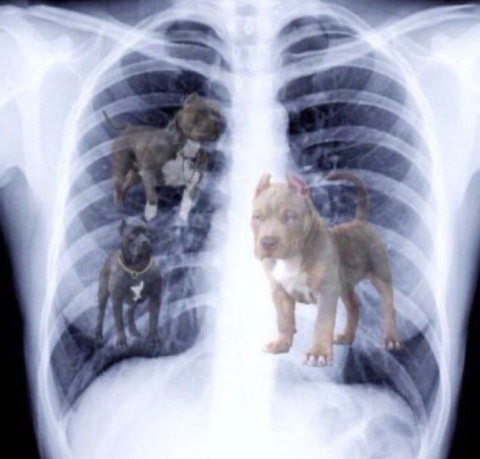
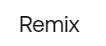
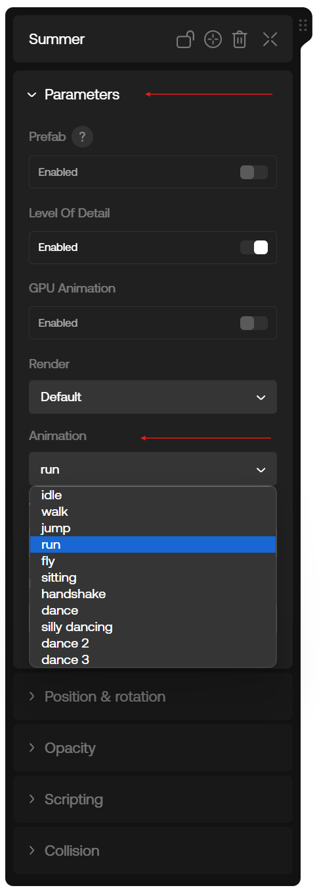
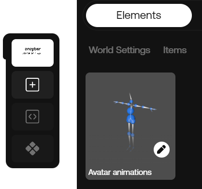
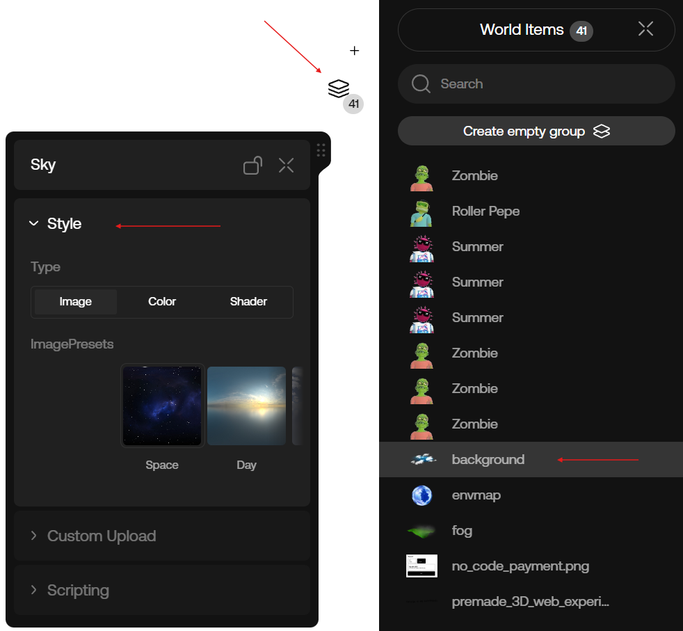
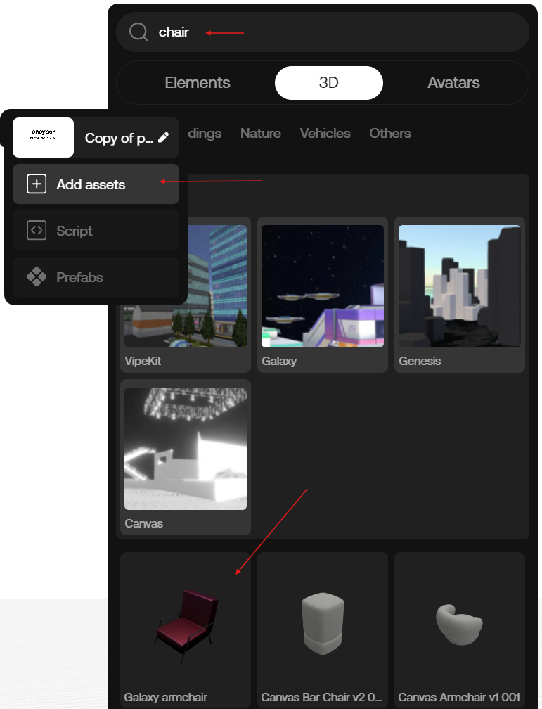
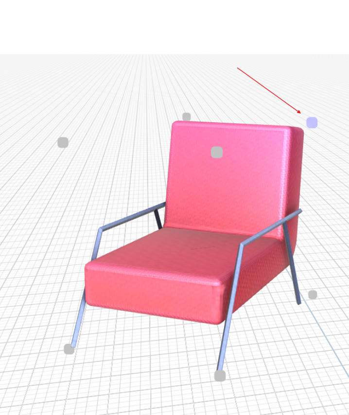
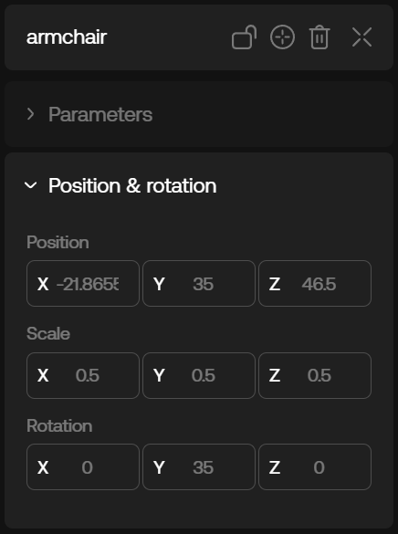
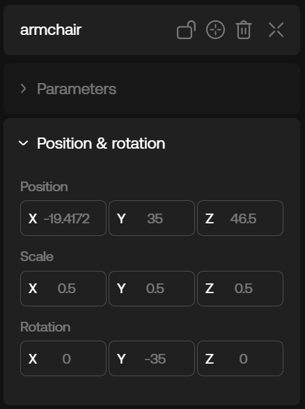
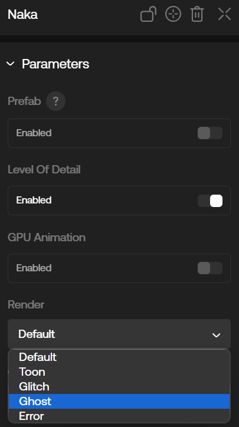

# Remixing Guide

# Introduction

Good morning.

oncyber helps creators make robust 3D web experiences.

Keep in mind that oncyber v2 is early. If your xray doesn't look like this, come back later:

> Tip: this is an analogy.

Otherwise, have patience and enjoy what other people create!

## Remixing a Template

Remixing a Template is a great way to familiarize yourself with the platform's capabilities.

In the context of oncyber v2, Templates are a premade 3D experience you can remix.

We'll introduce you to the full library later -- but first, we'll start with the (aptly named) Onboarding Template.

By the end of this tutorial, you'll have built your first animated 3D scene.

Lets get it. 

### 1. Remix the Onboarding Template
Go to the onboarding Remix experience link: https://v2.oncyber.io/onboarding

In the bottom right corner, there is a "Remix" button -- click it:

> Note: If you are not already on the early access list, please join our Discord and request it!

This will open an identical copy in your own Studio editor. Let’s start with some easy changes.

### 2. Make Summer Run!

Navigate to Summer (the pink sun avatar with sweet shades in the first scene) in the Studio.

Not sure how to navigate Oncyber's Studio editor?

Please refer to our [Studio Guide](./studio.mdx) first.

All good? Great. Click on Summer -- this will open the Avatar [Component](../components.mdx) UI.

Click "Parameters" to expand the Folder, click the dropdown menu under "Animation" and select "run":

The effect will take place on the selected Avatar immediately in the Studio -- however, If you want to confirm it worked on the frontend, you can click the "Preview" button in the lower right above "Publish."

This will open a preview of your remixed version in a new tab, where you should find Summer happily engaged in a no-distance marathon.

### 3. Add Custom Animations to Your Avatar (Optional)

Want to change the flavor of animations on avatars in your remix?

Adding the Avatar Animations Component pictured here allows you to swap out the default animations for Avatars, and add your own conditionally-triggered Custom animations as well:

Learning how to add your own custom animations is going to get a little complex and take a few extra steps, so this step is optional.

### 4. Add Some Clouds (or Stars or Color)

Want to slap some sky on that white canvas? It's easy as:

1. Click the stack icon in the top-right to expand the "World Items" list.

2. Click "background" and Expand the "Style" Folder in the Sky UI that appears.

3. Slap on some new sky -- you can choose a preset image or get fancy with custom options.

### 5. Pull Up a Chair (or Two, to Be Polite)

Did you think we were going to let Summer run forever? Let's be a good host and pull up some chairs.

For this, you can access our free library of 3D assets -- simply:

1. Click the "Add assets" button in the left-hand column.

2. Click the "3D" tab.

3. Search "chair" in the bar above.

4. Drag and Drop a chair next to each avatar.

5. Use the Gizmo to rotate and reposition the chairs till they're in a nice spot.

6. If the chairs seem to be made for giants (or ants) when added, you can easily resize these by hovering over the edge of the model once selected, then clicking and dragging any of the corner points that appear -- for example:

> Tip: Having trouble getting Components in your scene _just right_? This next section is for you:

You can also manually change the Transform values (Position, Rotation, and Scale) using the "Position & rotation" folder in any model Component's UI.

This can be handy for aligning two objects on the exact same vertical or horizontal axis, simply by entering the same value for each.

Here's an example of some values you can use to align the chairs in your scene:

See how the Y and Z axis are the same, while only the X axis is different?

That means the models only differ on the horizontal axis in the direction the camera is facing, placing them across from each other (otherwise they would overlap if X/Y/Z were all the same).

In a similar sense, note how the rotation value is 35 and -35 -- this gives the chairs the same rotation in opposite directions to mirror one another, facing inward.

### 6. Seating the Avatars

Remember Choose Your Own Adventure Books? No?

What about Step Two? Because Step Six is just like both -- except, this time, you're choosing "sit" for each avatar.

### 7. Throw on Some ~Jazz~ with Visual Effects for Avatars

Want to add some glitch vibes to Summer to honor their origins?

Feel like Naka hasn't really been present lately and may as well be a ghost?

Here's something fun: select an Avatar and go to the Parameters tab.

See the "Render" setting? Expand that dropdown and try an option, then Preview your experience, and enjoy the (visual) jazz.

### 8. Have Fun!

Do whatever feels right. There are unlimited possibilities when it comes to scene building -- just take it step-by-step and have fun as you familiarize yourself with the platform.

## Further Customization

Templates make it easy to get started -- but that's just the first step.

The deeper you get, the more you'll find you can customize just about anything in oncyber, to any degree you like.

### Choose Your Next Adventure:

[Getting Started Guide](./getting_started.md)

Continue your 3D creation with the Getting Started Guide, where we break down how to add custom scripting logic to your scene -- but remember, this is for dogs only. If you're not barking yet, reach deep and find that dog within -- because this is where it all gets really interesting.

[All You Need is GPT](./gptguide.md) (RECOMMENDED)

If you're new to coding, or simply prefer a quicker route, this next guide will cover how to work with oncyber's scripting GPT to unlock new levels of customization and interaction for your experiences -- all without needing an extensive developer background (GPT takes care of that for you).