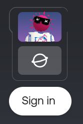
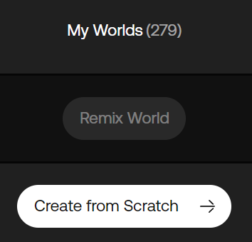
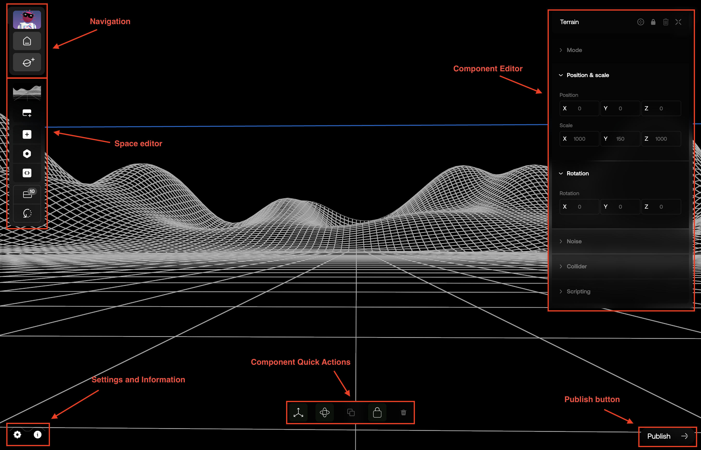
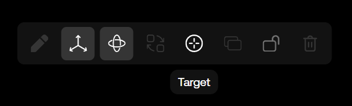
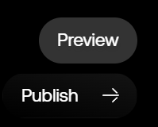
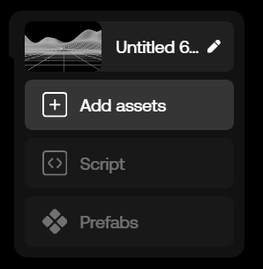
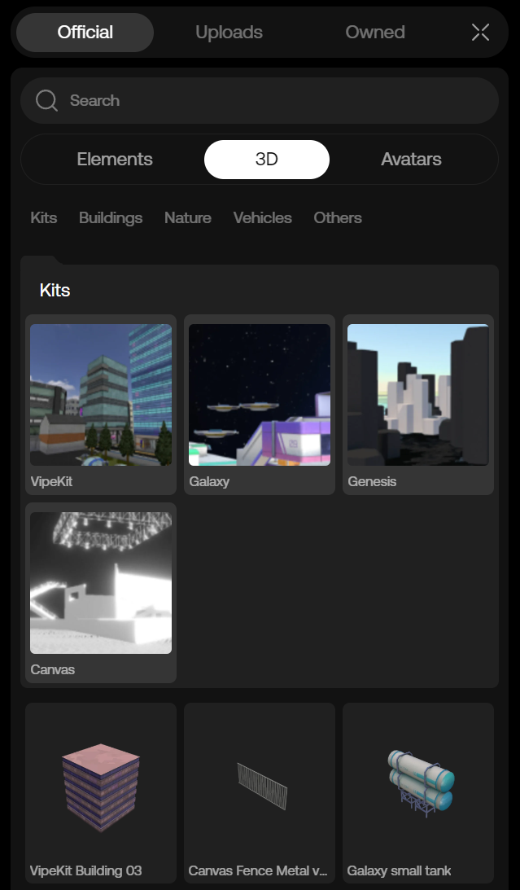
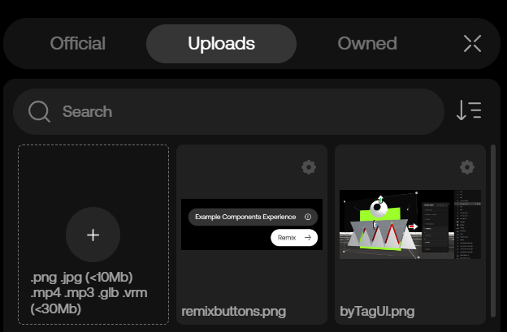
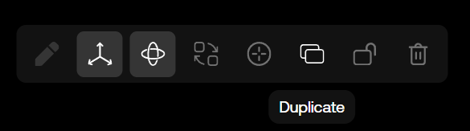

# Studio Guide

Want to create or remix your own oncyber experience?

For that, you'll need to know your way around the Studio -- but don't worry: like GPT, this guide is here to help.

First, navigate to https://v2.oncyber.io/ and create an account or sign in.

Once signed in, click the "Worlds" button in the top-left.

This will open a panel on your screen with any existing worlds or experiences you've created on the right, and the option to 'Remix' or 'Create from Scratch' on the left.

For the purpose of this guide, click 'Create from Scratch' -- this will take you to the Studio, where a new world awaits.

The Studio editor -- also accessible directly at https://v2.oncyber.io/studio -- is where the magic happens.

Using a combination of frontend UI-based tools and an optional layer of scripting, the Studio allows you to create just about any digital experience you can think of.

Here's the current layout of the Studio editor:

### Moving Around the Scene

In the context of the oncyber Studio editor, a scene is where you add [Components](../components_guide.mdx) to your world with a visible position.

You can move around the scene in a lateral direction by pressing either W/A/S/D or the arrow keys on your keyboard. You can also move vertically by pressing spacebar to go up, or B to go down.

You can also click and drag the left button to look around your scene, or click and drag the right button to move up and down. To zoom in/out, you can use the scroll wheel on a mouse.

> Tip: to quickly relocate the camera to any Component in your scene, select the Component and click the "Target" icon:

### Previewing the Experience

At any point, you can preview your experience by clicking on the "Preview" button in the bottom-right corner of the screen:

This will open a new tab with your experience running in it.

### Adding a 3D Asset to the Scene

To add a 3D asset to the scene, expand the mid-left UI and click the "Add assets" button:

In the UI panel that opens on the "Official" and nested "Elements" tabs, click "3D" -- this will open the list of our free 3D assets.

You can add 3D assets to the scene by dragging them from the list, or just by clicking -- when clicking, the chosen asset will be added in front of your current view in the scene.

> Tip: you can use Ctrl + Z to undo and Ctrl + Y to redo.

### Moving the 3D Asset Around

To move the 3D asset (or any other added Component with a physical location in your scene around), find it in your scene and click to select it.

This will open the UI for the selected Component in the right-hand of the screen. In the Component editor menu, you can change the position, rotation, and scale of the 3D asset (also called a "Transform"):

You can also change the position and rotation of the 3D asset directly by dragging it around your scene, or by using the Gizmo.

If you're not already familiar with the Gizmo from other 3D applications, it's time for an introduction:

See those arrows? Clicking and dragging on one allows you to move any unlocked, position-located Component in your scene on the axis clicked.

### Uploading a Custom .GLB model

In addition to the prebuilt 3D assets provided, you can also upload your own custom models (and other assets) to a scene.

To upload your own model, click the "Add assets" button again, but this time select the "Uploads" tab to the right of "Official." 

You can upload a model by dragging it from your computer's file explorer to the Studio Upload menu in your browser, or by clicking the "+" button in the Upload tab and finding the desired file on your computer:

Once your model is uploaded, it'll show up in the World Items list in your scene (which is expandable by clicking the two stacked diamond icons on the top-right of the Studio interface).

> Note: it's important that custom 3D .GLB files are well-optimized and have a small file size, as these factors influence the loading time of your oncyber experience and its performance. For 3D model optimization tips and tricks, visit the "Build Chat" channel of our Discord.

### Duplicating Objects

You can duplicate Components in the Studio by clicking to select them, then pressing Ctrl/Cmd + D on your keyboard, or by clicking the Duplicate icon:

This will create a copy of the object with the same parameters as the original object.