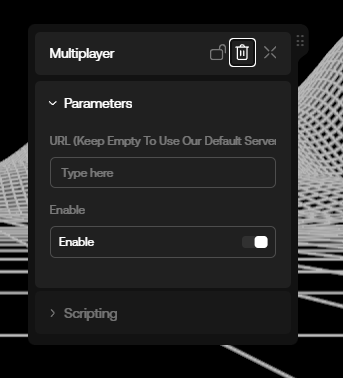

# Multiplayer (Alpha)

## Introduction

By default, every new game created with our engine starts in multiplayer mode. You can disable this feature by disabling the multiplayer option in the space's settings, or by removing the Multiplayer Component from your scene in the World Items list:



The current default behavior of the Multiplayer Component is a simple player state synchronization. This means that when a player joins a space, they will be able to see other players and their movements in the world in real-time.

## Sending Multiplayer Messages

Here's an example of broadcasting a message to all players:

```ts copy {1, 4, 5, 8, 9, 13, 17-21, 24-27, 30} filename="main"
import Multiplayer from "./Multiplayer";

export default class Game {
    private multiplayerManager: Multiplayer;
    private offMessage = null;

    onReady = async () => {
        this.multiplayerManager = Multiplayer.getMain();
        this.offMessage = this.multiplayerManager.room.onMessage(this.onMessage);
    }

    onStart = () => {
        this.sendMessage();
    }

    sendMessage = () => {
        multiplayerManager.room.send({
            type: "broadcast", // required
            hello: "world",
            exclude: [], // optional: array of player sessionIds to exclude from the boardcast
        })
    }

    onMessage = (message) => {
        const type = message.type;
        console.log("New message from the server!", type, message);
    }

    onDispose = () => {
        this.offMessage();
    }
}
```

Example of sending a message to a specific player:

```ts copy
// we get the main multiplayer component
const multiplayerManager = Multiplayer.getMain();

// we store the players list in a variable
const players = Object.values(multiplayerManager.room.state.players.toJSON())

let playerSessionId = null

// we loop through the players list to find a player that is not us
players.forEach((_player: any) => {
    if (_player.sessionId !== Multiplayer.me.sessionId) {
        playerSessionId = _player.sessionId
        return
    }
})

// if we found another player, we send him a message
if (playerSessionId) {
    Multiplayer.room.send({
        type: "send", // required
        playerId: playerSessionId, // required
        payload: {
            hello: "world from player",
        },
    })
}
```

> Note: Multiplayer.room is of the [GameRoom](./reference/gameroom.md) type.