# Prefabs

Prefabs are reusable objects that act as templates, allowing you to create, configure, and store complex objects with all of their properties, children, and behaviors.

Prefabs can be used multiple times in an oncyber experience. They are especially useful for creating and managing recurring objects, such as enemies, items, or environmental features, enabling easy updates and modifications.

By modifying a Prefab, all instances of that Prefab within your experience can be updated simultaneously.

To create a Prefab, simply select the object you want to turn into a Prefab and enable the toggle for this in its main Parameters Folder.

Once toggled on, this will turn yellow in the World Items list to indicate that it's now a Prefab:

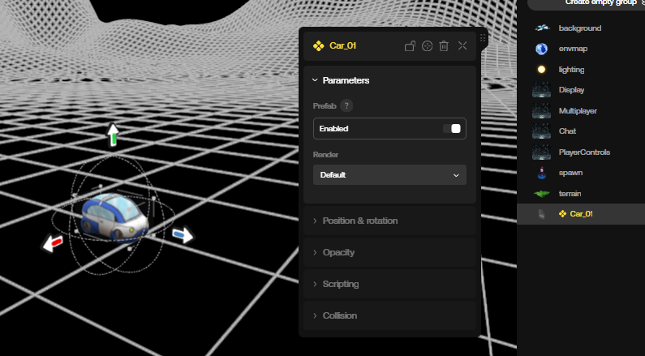

Now that you've created a Prefab, you should also be able to find it in the left Prefabs panel -- from there you can click to add it, or drag and drop it somewhere specific in your scene:

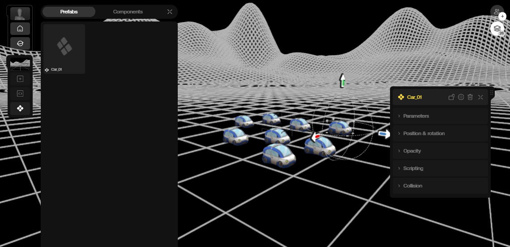

Next, let's try updating our Prefab object. For example, we can change its render mode to `Glitch`.

After making any changes to a Prefab, you'll notice two buttons above the altered Parameter, indicating that the current object has an updated state.

The left button allow us to apply the change to the Prefab, while the button on the right reverts the changed Parameter to its original value.

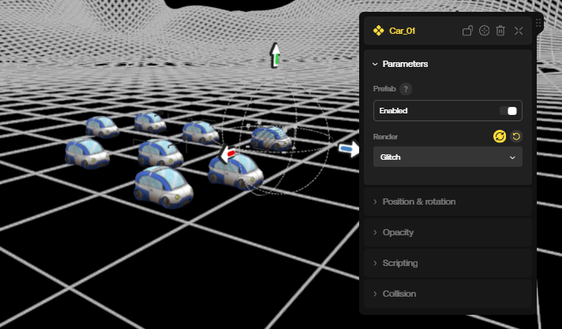

If you click on the left button to apply your change, you'll notice that any other instances of the Prefab you've added to your scene have also applied this render mode change.

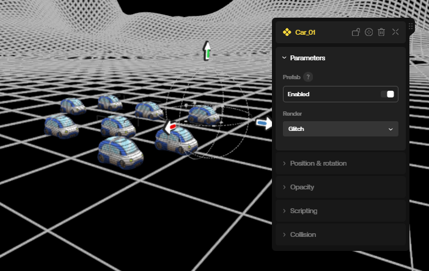

In a similar manner, if you add a [`Behavior`](./behaviors.mdx) to a Prefab, you will see a purple Apply button appear to the right of the Behavior's name. Clicking this applies the Behavior to all instances of your Prefab:

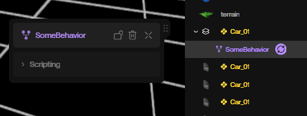

# Group Prefabs

## Creating a Group

In addition to individual objects, you can also turn entire Groups into Prefabs.

Groups are essentially sets of objects inside a container object (similar to parenting objects to an empty in Blender, or moving a set of a files into a folder on a computer).

You can create a new Group in oncyber's Studio two different ways:

1: Select multiple objects and press G to merge them into a group.

2: At the top of the World Items list in the right-hand column, click "Create Empty Group" and then drag the objects you want inside that Group.

In the World Items list, Groups are represented by a grey icon with two squares stacked on top of each other. The Group is referred to as a Parent, and objects inside a group are Children.

If there are any objects inside a Group, ">" icon will appear to the left of its name. Clicking this will expand the Group, allowing you to access the UI of objects grouped within.

Once several objects are grouped, you can select the Group in the World Items list and move it like you would any single object -- with one difference: moving a Group allows you to move all objects inside at once.

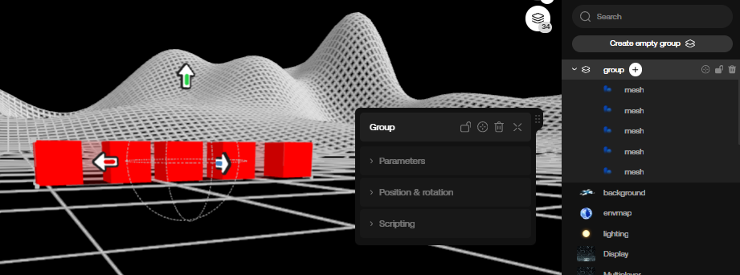

## Making the Group a Prefab

If you enable the Prefab option on a Group itself, you'll note that the Children also turn yellow in the World Items list -- this mean they are also part of the Prefab.

When you update a Parameter on the Parent Group, or add a Behavior to one of the Children, you can apply your changes to all other instances of the Prefab:

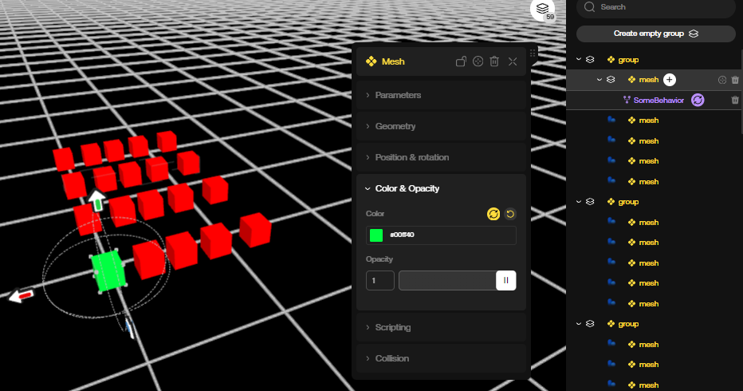
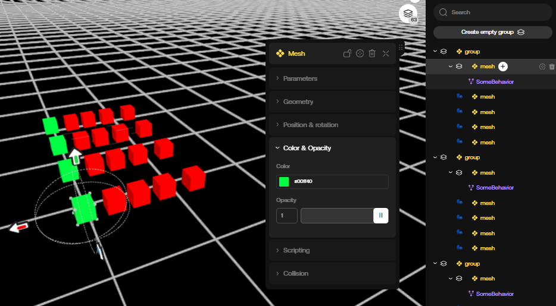

If you move one of the Children in a Group, you can also apply its new relative position to the Group, applying that same relative position adjustment to all other instances of your Prefab Group from their current positions:

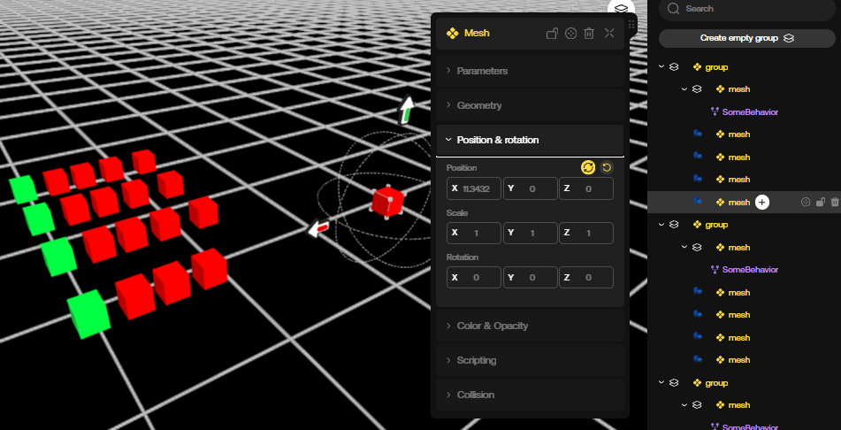
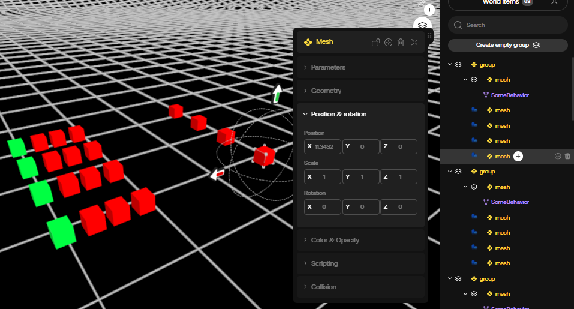

# Prefab Variants

When you have a Prefab that has one or more override states, you can optionally create a Prefab variant by pressing "P" on the keyboard.

For example this car has a `Toon` render mode, while the Prefab has a `Glitch` render mode:

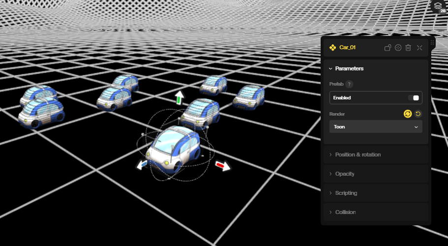

After making your change, select the Group Parent you want to make a variant from and press "P" -- a window will appear requesting a new name. Let's call this variant `toon-car`:

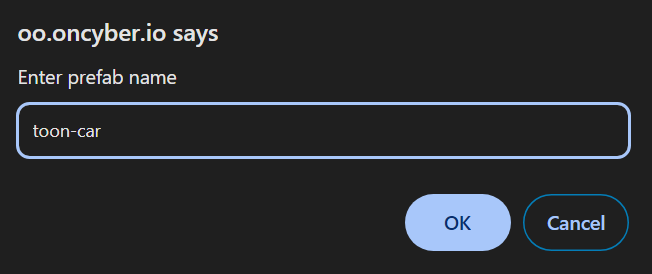

After clicking "OK" in the next window that asks for confirmation, we now have a new Prefab Variant in our list that we can drag and drop into the scene:

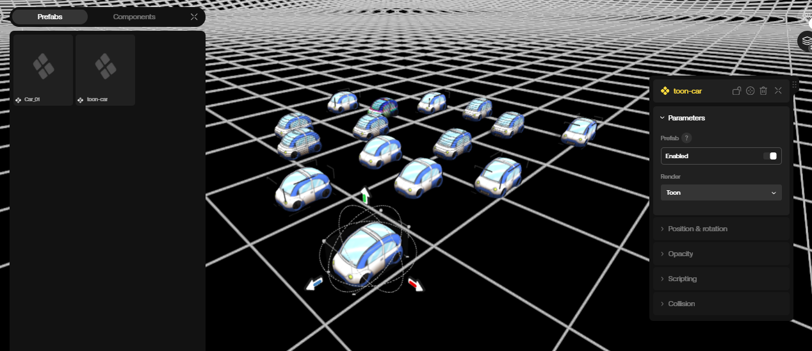

**Important Note:** Prefab Variants will also inherit _new changes_ from the Prefab they were created from.

This means if you change something other than the render mode (or whatever changes you've made in cases beyond this example) on the original Prefab and apply it, those will be applied to the Prefab Variant as well.

Let's try making the original Prefab with the glitch version of the car bigger, and apply that change:

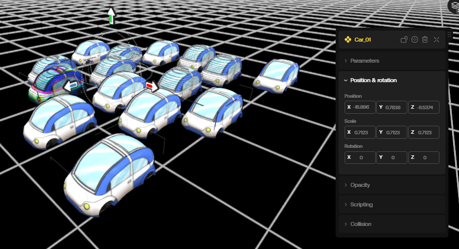

As soon as the changes are applied, you'll note that all versions of the Prefab match it in size -- including the Prefab Variant.

Note that this does not work in reverse; if we instead apply a change on the Prefab Variant, it won't apply to the original. This can be useful when you have objects that share something in common.

For example, let's make our Prefab Variant toon cars transparent and apply the changes:

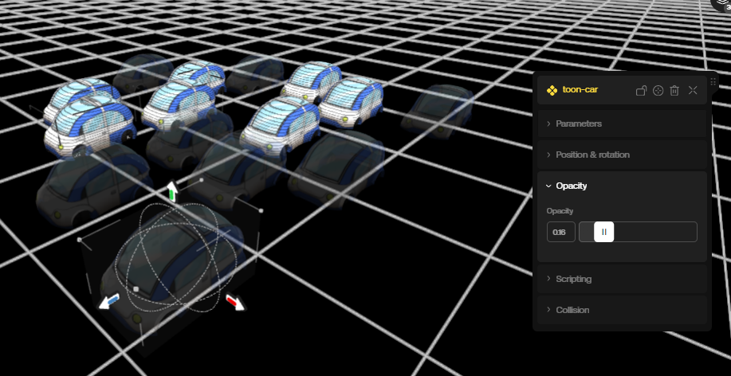

Note that only the Prefab Variant toon cars were made transparent -- the original cars stayed the same.

> Tip: Prefab Variants can also be made from other Prefab Variants, allowing for cascading chains of assets with Group modularity.
